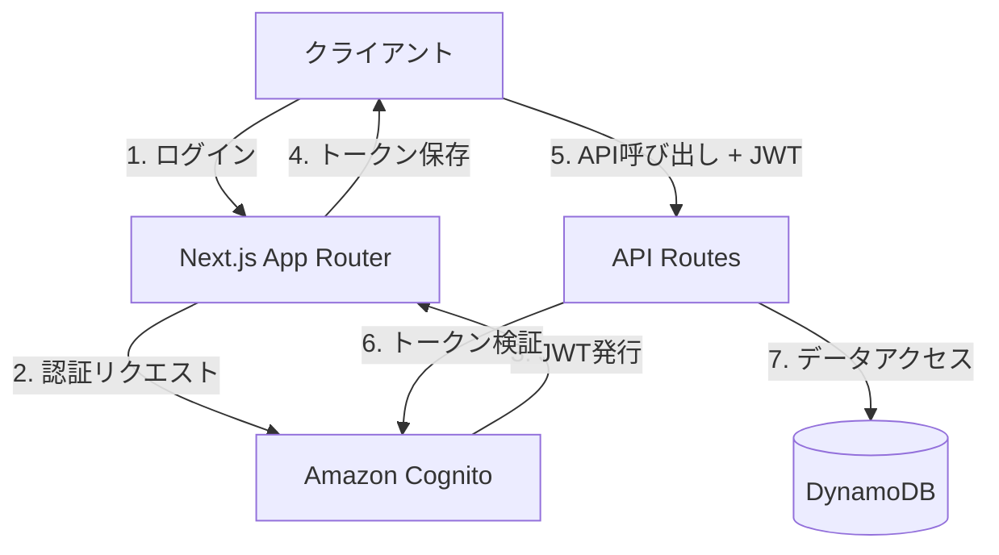
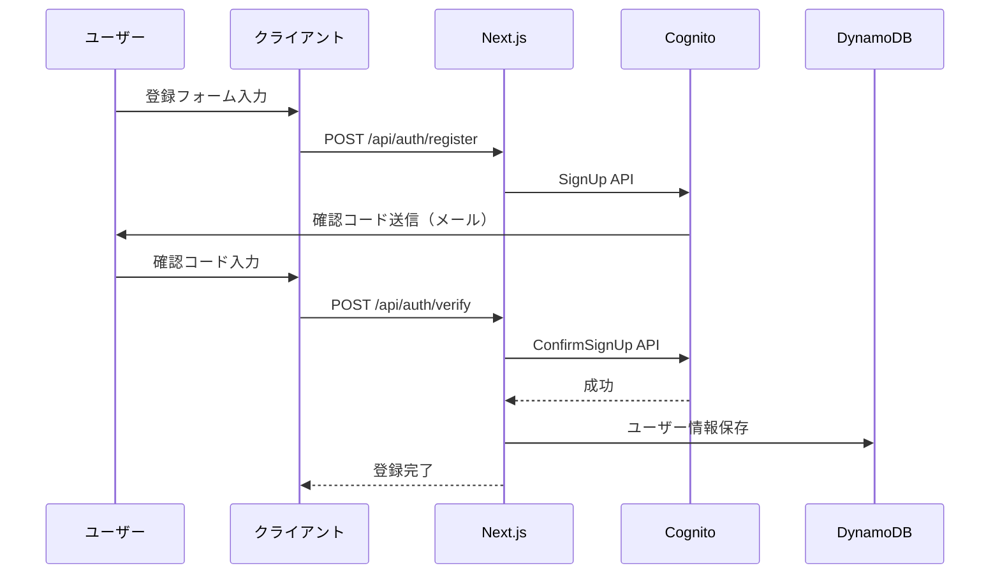
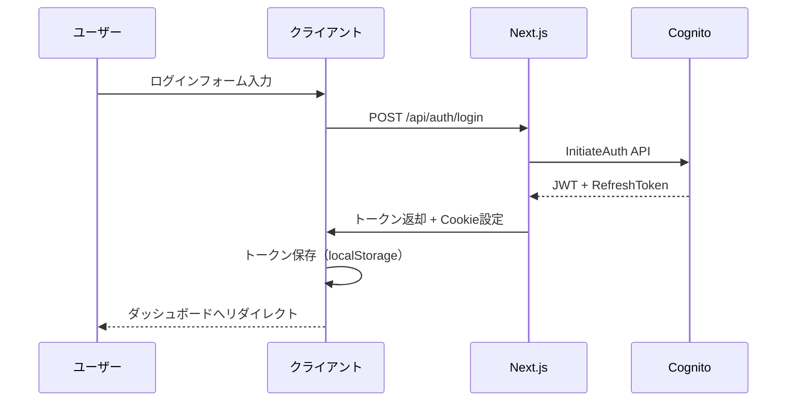
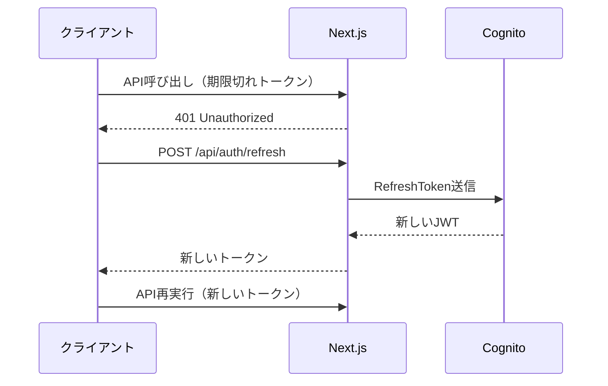
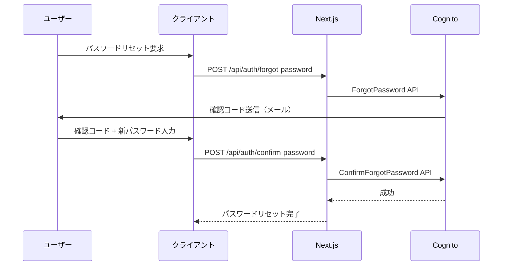

# 認証・セキュリティ設計

## 概要

Coordy（コーディ）プラットフォームの認証・セキュリティ設計書です。
Amazon Cognitoを中心とした認証基盤とセキュリティ対策を定義します。

---

## 認証アーキテクチャ

### 全体構成



---

## Amazon Cognito設定

### ユーザープール構成

**プール名**: `coordy-user-pool-{env}`

**属性設定**:
```json
{
  "標準属性": {
    "email": {
      "required": true,
      "mutable": true
    },
    "name": {
      "required": true,
      "mutable": true
    }
  },
  "カスタム属性": {
    "custom:role": {
      "type": "String",
      "mutable": true
    },
    "custom:userId": {
      "type": "String",
      "mutable": false
    }
  }
}
```

### パスワードポリシー

```json
{
  "minimumLength": 8,
  "requireLowercase": true,
  "requireUppercase": true,
  "requireNumbers": true,
  "requireSymbols": false,
  "temporaryPasswordValidityDays": 7
}
```

### MFA設定

```json
{
  "mfaConfiguration": "OPTIONAL",
  "enabledMfas": ["SOFTWARE_TOKEN_MFA"],
  "smsConfiguration": {
    "snsRegion": "ap-northeast-1"
  }
}
```

---

## 認証フロー

### 1. ユーザー登録フロー



### 2. ログインフロー



### 3. トークンリフレッシュフロー



---

## ロールベースアクセス制御（RBAC）

### ロール定義

| ロール | 権限レベル | アクセス範囲 |
|--------|-----------|-------------|
| **user** | 1 | 自身のデータのみ |
| **instructor** | 2 | 自身のサービス・顧客データ |
| **admin** | 3 | 全データアクセス |

### 権限マトリックス

| リソース | user | instructor | admin |
|---------|------|-----------|-------|
| 自分のプロフィール | R/W | R/W | R/W |
| 他ユーザーのプロフィール | - | - | R/W |
| サービス閲覧 | R | R | R/W |
| サービス作成 | - | R/W | R/W |
| 予約作成 | R/W | - | R/W |
| 予約管理（自分） | R/W | R | R/W |
| 予約管理（全体） | - | - | R/W |
| 支払い（自分） | R/W | - | R/W |
| 支払い（全体） | - | - | R |

**凡例**: R=読み取り、W=書き込み、-=アクセス不可

---

## Middleware実装

### middleware.ts

```typescript
// middleware.ts
import { NextRequest, NextResponse } from 'next/server';
import { verifyToken } from '@/lib/auth';

export async function middleware(request: NextRequest) {
  const token = request.cookies.get('auth_token')?.value;
  const path = request.nextUrl.pathname;

  // 認証が必要なパス
  const protectedPaths = ['/user', '/instructor', '/admin'];
  const isProtectedPath = protectedPaths.some(p => path.startsWith(p));

  if (isProtectedPath && !token) {
    // 未認証の場合、ログインページへリダイレクト
    const role = path.split('/')[1];
    return NextResponse.redirect(new URL(`/${role}/login`, request.url));
  }

  if (token) {
    try {
      // トークン検証
      const payload = await verifyToken(token);
      const userRole = payload['custom:role'];
      const pathRole = path.split('/')[1];

      // ロールチェック
      if (userRole !== pathRole && userRole !== 'admin') {
        return NextResponse.redirect(new URL(`/${userRole}`, request.url));
      }

      // リクエストヘッダーにユーザー情報を追加
      const requestHeaders = new Headers(request.headers);
      requestHeaders.set('x-user-id', payload['custom:userId']);
      requestHeaders.set('x-user-role', userRole);

      return NextResponse.next({
        request: {
          headers: requestHeaders,
        },
      });
    } catch (error) {
      // トークンが無効な場合
      return NextResponse.redirect(new URL('/user/login', request.url));
    }
  }

  return NextResponse.next();
}

export const config = {
  matcher: ['/((?!api|_next/static|_next/image|favicon.ico).*)'],
};
```

---

## トークン管理

### JWT構造

```json
{
  "header": {
    "alg": "RS256",
    "typ": "JWT",
    "kid": "..."
  },
  "payload": {
    "sub": "user-123",
    "email": "user@example.com",
    "custom:role": "user",
    "custom:userId": "user-123",
    "iat": 1634567890,
    "exp": 1634571490
  }
}
```

### トークン保存

**クライアント側**:
```typescript
// localStorage (アクセストークン)
localStorage.setItem('access_token', token);

// Cookie (リフレッシュトークン - HttpOnly)
// サーバー側で設定
```

**セキュリティ設定**:
```typescript
// Cookie設定
res.setHeader('Set-Cookie', [
  `refresh_token=${refreshToken}; HttpOnly; Secure; SameSite=Strict; Path=/; Max-Age=${7 * 24 * 60 * 60}`
]);
```

### トークン有効期限

- **アクセストークン**: 1時間
- **リフレッシュトークン**: 7日間
- **IDトークン**: 1時間

---

## セキュリティ対策

### 1. HTTPS強制

```typescript
// next.config.ts
export default {
  async headers() {
    return [
      {
        source: '/:path*',
        headers: [
          {
            key: 'Strict-Transport-Security',
            value: 'max-age=63072000; includeSubDomains; preload'
          }
        ]
      }
    ];
  }
};
```

### 2. CSRF対策

```typescript
// lib/csrf.ts
import { randomBytes } from 'crypto';

export function generateCsrfToken(): string {
  return randomBytes(32).toString('hex');
}

export function verifyCsrfToken(token: string, expected: string): boolean {
  return token === expected;
}

// APIルート
export async function POST(request: Request) {
  const csrfToken = request.headers.get('X-CSRF-Token');
  const sessionToken = request.cookies.get('csrf_token')?.value;

  if (!csrfToken || csrfToken !== sessionToken) {
    return new Response('Invalid CSRF token', { status: 403 });
  }

  // 処理続行
}
```

### 3. XSS対策

```typescript
// Content Security Policy
const cspHeader = `
  default-src 'self';
  script-src 'self' 'unsafe-eval' 'unsafe-inline' https://js.stripe.com;
  style-src 'self' 'unsafe-inline';
  img-src 'self' blob: data: https:;
  font-src 'self';
  object-src 'none';
  base-uri 'self';
  form-action 'self';
  frame-ancestors 'none';
  upgrade-insecure-requests;
`;

// next.config.ts
headers: [
  {
    key: 'Content-Security-Policy',
    value: cspHeader.replace(/\n/g, '')
  }
]
```

### 4. レート制限

```typescript
// lib/rate-limit.ts
import { Ratelimit } from '@upstash/ratelimit';
import { Redis } from '@upstash/redis';

const redis = new Redis({
  url: process.env.UPSTASH_REDIS_URL!,
  token: process.env.UPSTASH_REDIS_TOKEN!
});

export const ratelimit = new Ratelimit({
  redis,
  limiter: Ratelimit.slidingWindow(100, '1 m'), // 100req/min
});

// APIルート
export async function GET(request: Request) {
  const ip = request.headers.get('x-forwarded-for') ?? 'anonymous';
  const { success } = await ratelimit.limit(ip);

  if (!success) {
    return new Response('Too Many Requests', { status: 429 });
  }

  // 処理続行
}
```

### 5. 入力検証

```typescript
// lib/validation.ts
import { z } from 'zod';

// ユーザー登録スキーマ
export const registerSchema = z.object({
  name: z.string().min(1).max(50),
  email: z.string().email(),
  password: z
    .string()
    .min(8)
    .regex(/^(?=.*[a-z])(?=.*[A-Z])(?=.*\d).+$/),
  role: z.enum(['user', 'instructor', 'admin'])
});

// APIルート
export async function POST(request: Request) {
  const body = await request.json();

  try {
    const validatedData = registerSchema.parse(body);
    // 処理続行
  } catch (error) {
    return new Response('Validation Error', { status: 400 });
  }
}
```

---

## セッション管理

### セッションストア

```typescript
// lib/session.ts
import { SignJWT, jwtVerify } from 'jose';

const secret = new TextEncoder().encode(process.env.JWT_SECRET!);

export async function createSession(payload: any) {
  return await new SignJWT(payload)
    .setProtectedHeader({ alg: 'HS256' })
    .setIssuedAt()
    .setExpirationTime('1h')
    .sign(secret);
}

export async function verifySession(token: string) {
  try {
    const { payload } = await jwtVerify(token, secret);
    return payload;
  } catch (error) {
    throw new Error('Invalid token');
  }
}
```

### セッションタイムアウト

- **アイドルタイムアウト**: 30分
- **絶対タイムアウト**: 24時間
- **自動延長**: APIアクセス時に自動延長

---

## 監査ログ

### ログ記録項目

```typescript
interface AuditLog {
  timestamp: string;
  userId: string;
  action: string;
  resource: string;
  ipAddress: string;
  userAgent: string;
  status: 'success' | 'failure';
  details?: any;
}

// 例
{
  timestamp: '2025-10-11T10:30:00Z',
  userId: 'user-123',
  action: 'LOGIN',
  resource: '/api/auth/login',
  ipAddress: '192.168.1.1',
  userAgent: 'Mozilla/5.0...',
  status: 'success'
}
```

### 記録対象イベント

- ログイン・ログアウト
- ユーザー登録
- パスワード変更
- ロール変更
- データアクセス（管理者）
- 決済処理
- 重要データの変更

### ログ保存先

- **CloudWatch Logs**: リアルタイムモニタリング
- **S3**: 長期保存（1年間）
- **検索**: CloudWatch Insights

---

## パスワード管理

### パスワードリセットフロー



### パスワードハッシュ

- **アルゴリズム**: bcrypt
- **ソルトラウンド**: 10
- **Cognito管理**: パスワードはCognitoで暗号化保存

---

## セキュリティヘッダー

### 推奨設定

```typescript
// next.config.ts
export default {
  async headers() {
    return [
      {
        source: '/:path*',
        headers: [
          {
            key: 'X-DNS-Prefetch-Control',
            value: 'on'
          },
          {
            key: 'Strict-Transport-Security',
            value: 'max-age=63072000; includeSubDomains; preload'
          },
          {
            key: 'X-Frame-Options',
            value: 'SAMEORIGIN'
          },
          {
            key: 'X-Content-Type-Options',
            value: 'nosniff'
          },
          {
            key: 'X-XSS-Protection',
            value: '1; mode=block'
          },
          {
            key: 'Referrer-Policy',
            value: 'origin-when-cross-origin'
          },
          {
            key: 'Permissions-Policy',
            value: 'camera=(), microphone=(), geolocation=()'
          }
        ]
      }
    ];
  }
};
```

---

## セキュリティチェックリスト

### 開発時

- [ ] すべてのAPIエンドポイントに認証を実装
- [ ] ロールベース認証の実装
- [ ] 入力検証の実装
- [ ] CSRF対策の実装
- [ ] レート制限の実装

### デプロイ前

- [ ] HTTPS強制の確認
- [ ] セキュリティヘッダーの設定
- [ ] 環境変数の適切な管理
- [ ] 秘密鍵のローテーション計画
- [ ] 監査ログの有効化

### 運用時

- [ ] 定期的なセキュリティ監査
- [ ] 脆弱性スキャン（月次）
- [ ] アクセスログの監視
- [ ] インシデント対応手順の整備
- [ ] セキュリティパッチの適用

---

## インシデント対応

### 対応フロー

1. **検知**: モニタリングアラート
2. **初動**: 影響範囲の特定
3. **封じ込め**: 不正アクセスのブロック
4. **根絶**: 脆弱性の修正
5. **復旧**: サービスの正常化
6. **事後対応**: 原因分析・再発防止

### エスカレーション

- **Level 1**: 自動アラート → オンコール担当者
- **Level 2**: 重大インシデント → チームリーダー
- **Level 3**: 緊急事態 → 経営層

---

---

## 認証フロー動作確認手順

### 認証フロー図

```
【STEP 1】サインアップ (/signup/user, /signup/instructor)
  ↓ Cognito signUp実行
【STEP 2】メール確認 (/verify?email=xxx)
  ↓ Cognito confirmSignUp実行
【STEP 3】ログイン (/login/user, /login/instructor)
  ↓ Cognito signIn実行 → セッション保存
  ※ 別ロールでログイン中の場合は自動でセッション切替
【STEP 4】ダッシュボード (/user, /instructor)
```

### 自動セッション切替

別ロールでログイン中に新しいアカウントでログインを試みた場合:
1. システムが自動的に現在のセッションをサインアウト
2. 新しい認証情報でサインイン
3. ユーザーにはエラーなくシームレスにログインが完了

詳細は `DOCS/flows/login-flow.md` のセクション9.1を参照。

### URL構造

| URL | 説明 | 認証 |
|-----|------|------|
| `/signup/user` | ユーザー新規登録 | 不要 |
| `/signup/instructor` | インストラクター新規登録 | 不要 |
| `/verify?email=xxx` | メール確認 | 不要 |
| `/login/user` | ユーザーログイン | 不要 |
| `/login/instructor` | インストラクターログイン | 不要 |
| `/login/user/forgot` | パスワードリセット申請 | 不要 |
| `/login/user/reset` | パスワードリセット実行 | 不要 |
| `/user/*` | ユーザー保護ページ | 必要 |
| `/instructor/*` | インストラクター保護ページ | 必要 |
| `/admin/*` | 管理者保護ページ | 必要 |

### パスワード要件

- 8文字以上
- 英大文字を1文字以上
- 英小文字を1文字以上
- 数字を1文字以上

### エラーメッセージ

| エラー | メッセージ |
|--------|----------|
| UserNotFoundException | このメールアドレスは登録されていません |
| NotAuthorizedException | パスワードが正しくありません |
| UserNotConfirmedException | メール確認が完了していません |
| CodeMismatchException | 確認コードが正しくありません |
| ExpiredCodeException | 確認コードの有効期限が切れています |

---

---

## 管理者ユーザー作成手順

管理者（admin）としてシステムにアクセスするには、以下の手順でユーザーを作成します。

> フロントエンド経由で `admin` ロールをサインアップすることはできません（`lib/auth/cognito.ts` の `registerUser` で拒否）。必ず Cognito コンソールから `ADMINS` グループに所属させてください。

### 管理者の定義

本システムでは、**Cognito ユーザープールの `ADMINS` グループに所属するユーザー**が管理者として扱われます。

ロール判定ロジック（`lib/auth/cognito.ts`）:
```typescript
if (groups.includes('ADMINS')) {
  role = 'admin';
}
```

### 管理者ユーザー作成手順

#### 1. Cognitoコンソールでユーザーを作成

1. AWS マネジメントコンソール → Cognito → ユーザープール (`coordy-user-pool-{env}`) を開く
2. 「ユーザー」タブ → 「ユーザーを作成」をクリック
3. 必要情報を入力:
   - メールアドレス: `admin@example.com`（任意のメールアドレス）
   - パスワード: パスワードポリシー（8文字以上、大小英字・数字必須）に従って設定
   - メール検証: 「検証済みとしてマーク」を選択
4. 「ユーザーを作成」をクリック

#### 2. ADMINS グループに追加

1. 作成したユーザーをクリック
2. 「グループ」タブ → 「グループに追加」をクリック
3. `ADMINS` グループを選択して追加

※ `ADMINS` グループが存在しない場合は、「グループ」タブから先に作成してください。

#### 3. 動作確認

1. `/manage/login` にアクセス
2. 作成した管理者のメールアドレスとパスワードでログイン
3. `/manage/admin`（管理者ダッシュボード）に遷移することを確認

### 管理者画面一覧

| ルート | 説明 |
|--------|------|
| `/manage/login` | 管理者ログインページ |
| `/manage/admin` | 管理者ダッシュボード（インストラクター本人確認書類審査） |
| `/admin` | 管理メニュー（保留中支払い、ユーザー管理、サービス管理等） |

### 注意事項

- 管理者アカウントはCognitoコンソールから手動で作成する必要があります
- 一般の登録フォーム（`/signup/*`）からは管理者アカウントを作成できません
- セキュリティ上、本番環境の管理者アカウントは最小限の人数に制限してください

---

*最終更新日: 2025-12-07*

*統合元: AUTH.md, AUTHENTICATION_FLOW.md*
