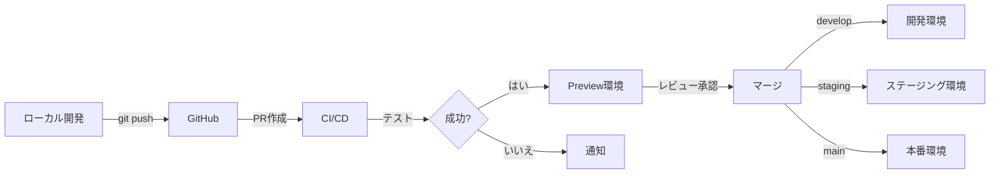

# デプロイメント手順

## 概要

Coordy（コーディ）プラットフォームのデプロイメント手順です。
AWS Amplify Hostingを使用した自動デプロイメントを実装します。

---

## デプロイメント戦略

### 環境構成

| 環境 | ブランチ | URL | 用途 |
|------|---------|-----|------|
| **開発** | `develop` | https://dev.coordy.app | 開発・テスト |
| **ステージング** | `staging` | https://staging.coordy.app | 本番前検証 |
| **本番** | `main` | https://coordy.app | 本番環境 |

### デプロイメントフロー



---

## AWS Amplify セットアップ

### 1. Amplify アプリ作成

```bash
# Amplify CLI でアプリ作成
amplify init

# 設定
? Enter a name for the project: coordy
? Enter a name for the environment: dev
? Choose your default editor: Visual Studio Code
? Choose the type of app that you're building: javascript
? What javascript framework are you using: react
? Source Directory Path: src
? Distribution Directory Path: .next
? Build Command: npm run build
? Start Command: npm run start

# Amplify にプッシュ
amplify push
```

### 2. Hosting 追加

```bash
# Hosting 追加
amplify add hosting

# 設定
? Select the plugin module to execute: Hosting with Amplify Console
? Choose a type: Continuous deployment (Git-based deployments)

# デプロイ
amplify publish
```

### 3. GitHub 連携

1. AWS Console → Amplify → アプリ選択
2. 「Connect repository branch」をクリック
3. GitHub 認証
4. リポジトリ・ブランチ選択
5. ビルド設定確認
6. 保存してデプロイ

---

## ビルド設定

### amplify.yml

```yaml
version: 1
backend:
  phases:
    build:
      commands:
        - amplifyPush --simple
frontend:
  phases:
    preBuild:
      commands:
        - npm ci
    build:
      commands:
        - npm run build
  artifacts:
    baseDirectory: .next
    files:
      - '**/*'
  cache:
    paths:
      - node_modules/**/*
      - .next/cache/**/*
```

### 環境別ビルド設定

**開発環境:**
```yaml
# amplify-dev.yml
version: 1
frontend:
  phases:
    preBuild:
      commands:
        - npm ci
        - echo "NEXT_PUBLIC_ENV=development" >> .env.production
    build:
      commands:
        - npm run build
  artifacts:
    baseDirectory: .next
    files:
      - '**/*'
```

**本番環境:**
```yaml
# amplify-prod.yml
version: 1
frontend:
  phases:
    preBuild:
      commands:
        - npm ci
        - echo "NEXT_PUBLIC_ENV=production" >> .env.production
    build:
      commands:
        - npm run build
        - npm run test
  artifacts:
    baseDirectory: .next
    files:
      - '**/*'
```

---

## 環境変数設定

### Amplify Console での設定

1. AWS Console → Amplify → アプリ → Environment variables
2. 以下の環境変数を追加:

```bash
# AWS
NEXT_PUBLIC_AWS_REGION=ap-northeast-1
NEXT_PUBLIC_USER_POOL_ID=ap-northeast-1_xxxxxxxxx
NEXT_PUBLIC_USER_POOL_CLIENT_ID=xxxxxxxxxxxxxxxxxxxxxxxxxx

# DynamoDB
DYNAMODB_TABLE_USERS=coordy-users-prod
DYNAMODB_TABLE_SERVICES=coordy-services-prod
DYNAMODB_TABLE_RESERVATIONS=coordy-reservations-prod
DYNAMODB_TABLE_TODOS=coordy-todos-prod
DYNAMODB_TABLE_PAYMENTS=coordy-payments-prod
DYNAMODB_TABLE_INSTRUCTORS=coordy-instructors-prod

# Stripe
NEXT_PUBLIC_STRIPE_PUBLISHABLE_KEY=pk_live_YOUR_PUBLISHABLE_KEY_HERE
STRIPE_SECRET_KEY=sk_live_YOUR_SECRET_KEY_HERE
STRIPE_WEBHOOK_SECRET=whsec_YOUR_WEBHOOK_SECRET_HERE

# JWT
JWT_SECRET=super-secure-production-secret-key

# その他
NEXT_PUBLIC_APP_URL=https://coordy.app
NODE_ENV=production
```

---

## CI/CD パイプライン

### GitHub Actions

**`.github/workflows/ci.yml`:**

```yaml
name: CI

on:
  pull_request:
    branches: [develop, staging, main]
  push:
    branches: [develop, staging, main]

jobs:
  test:
    runs-on: ubuntu-latest

    steps:
      - uses: actions/checkout@v3

      - name: Setup Node.js
        uses: actions/setup-node@v3
        with:
          node-version: '18'
          cache: 'npm'

      - name: Install dependencies
        run: npm ci

      - name: Run linter
        run: npm run lint

      - name: Run type check
        run: npm run type-check

      - name: Run tests
        run: npm run test:coverage

      - name: Upload coverage
        uses: codecov/codecov-action@v3
        with:
          file: ./coverage/coverage-final.json

      - name: Build
        run: npm run build

      - name: Notify Slack
        if: failure()
        uses: 8398a7/action-slack@v3
        with:
          status: ${{ job.status }}
          text: 'CI failed'
          webhook_url: ${{ secrets.SLACK_WEBHOOK }}
```

---

## デプロイ前チェックリスト

### コード品質

- [ ] ESLint エラーなし
- [ ] TypeScript エラーなし
- [ ] テストカバレッジ 80%以上
- [ ] ビルド成功

### セキュリティ

- [ ] 環境変数が正しく設定されている
- [ ] APIキーがコードに含まれていない
- [ ] 依存関係の脆弱性チェック (`npm audit`)
- [ ] HTTPS 強制設定

### パフォーマンス

- [ ] Lighthouse スコア 90+
- [ ] 画像最適化
- [ ] コード分割
- [ ] キャッシュ戦略

---

## デプロイ手順

### 開発環境デプロイ

```bash
# develop ブランチにマージ
git checkout develop
git merge feature/your-feature
git push origin develop

# Amplify が自動デプロイ
# https://dev.coordy.app で確認
```

### ステージング環境デプロイ

```bash
# staging ブランチにマージ
git checkout staging
git merge develop
git push origin staging

# Amplify が自動デプロイ
# https://staging.coordy.app で確認
```

### 本番環境デプロイ

```bash
# リリースタグ作成
git checkout main
git merge staging
git tag -a v1.0.0 -m "Release v1.0.0"
git push origin main --tags

# Amplify が自動デプロイ
# https://coordy.app で確認
```

---

## ロールバック手順

### Amplify Console でのロールバック

1. AWS Console → Amplify → アプリ
2. 「Deployments」タブ
3. 正常なバージョンを選択
4. 「Redeploy this version」をクリック

### Git でのロールバック

```bash
# 直前のコミットに戻す
git revert HEAD
git push origin main

# 特定のコミットに戻す
git revert <commit-hash>
git push origin main

# 強制的に戻す（非推奨）
git reset --hard <commit-hash>
git push origin main --force
```

---

## モニタリング

### CloudWatch メトリクス

```bash
# ログ確認
aws logs tail /aws/amplify/coordy --follow

# メトリクス確認
aws cloudwatch get-metric-statistics \
  --namespace AWS/AmplifyHosting \
  --metric-name Requests \
  --start-time 2025-10-10T00:00:00Z \
  --end-time 2025-10-11T00:00:00Z \
  --period 3600 \
  --statistics Sum
```

### アラート設定

```yaml
# cloudwatch-alarms.yml
Alarms:
  HighErrorRate:
    Type: AWS::CloudWatch::Alarm
    Properties:
      AlarmName: coordy-high-error-rate
      MetricName: 5XXError
      Namespace: AWS/AmplifyHosting
      Statistic: Sum
      Period: 300
      EvaluationPeriods: 2
      Threshold: 10
      ComparisonOperator: GreaterThanThreshold
      AlarmActions:
        - !Ref SNSTopic
```

---

## データベースマイグレーション

### マイグレーション手順

```bash
# マイグレーションスクリプト実行
npm run db:migrate

# または手動で
node scripts/migrate-db.js
```

**マイグレーションスクリプト例:**

```typescript
// scripts/migrate-db.ts
import { DynamoDBClient } from '@aws-sdk/client-dynamodb';
import { UpdateTableCommand } from '@aws-sdk/client-dynamodb';

async function migrate() {
  const client = new DynamoDBClient({ region: 'ap-northeast-1' });

  // GSI 追加
  await client.send(new UpdateTableCommand({
    TableName: 'coordy-users-prod',
    AttributeDefinitions: [
      { AttributeName: 'membership', AttributeType: 'S' }
    ],
    GlobalSecondaryIndexUpdates: [
      {
        Create: {
          IndexName: 'MembershipIndex',
          KeySchema: [
            { AttributeName: 'membership', KeyType: 'HASH' }
          ],
          Projection: { ProjectionType: 'ALL' }
        }
      }
    ]
  }));

  console.log('Migration completed');
}

migrate();
```

---

## バックアップ・復旧

### 自動バックアップ

```bash
# DynamoDB Point-in-Time Recovery 有効化
aws dynamodb update-continuous-backups \
  --table-name coordy-users-prod \
  --point-in-time-recovery-specification PointInTimeRecoveryEnabled=true

# オンデマンドバックアップ
aws dynamodb create-backup \
  --table-name coordy-users-prod \
  --backup-name coordy-users-backup-2025-10-11
```

### 復旧手順

```bash
# Point-in-Time Recovery
aws dynamodb restore-table-to-point-in-time \
  --source-table-name coordy-users-prod \
  --target-table-name coordy-users-prod-restored \
  --restore-date-time 2025-10-10T10:00:00Z

# バックアップからの復旧
aws dynamodb restore-table-from-backup \
  --target-table-name coordy-users-prod-restored \
  --backup-arn arn:aws:dynamodb:ap-northeast-1:123456789012:table/coordy-users-prod/backup/01234567890123-abcdefgh
```

---

## パフォーマンス最適化

### CDN 設定

- **CloudFront**: Amplify が自動設定
- **キャッシュTTL**: 3600秒（1時間）
- **圧縮**: Gzip, Brotli 有効

### 画像最適化

```typescript
// next.config.ts
export default {
  images: {
    domains: ['s3.amazonaws.com', 'coordy-assets.s3.amazonaws.com'],
    formats: ['image/avif', 'image/webp']
  }
};
```

---

## セキュリティ

### WAF 設定

```bash
# AWS WAF Web ACL 作成
aws wafv2 create-web-acl \
  --name coordy-waf \
  --scope CLOUDFRONT \
  --default-action Allow={} \
  --rules file://waf-rules.json
```

### SSL/TLS 証明書

```bash
# ACM 証明書リクエスト
aws acm request-certificate \
  --domain-name coordy.app \
  --subject-alternative-names www.coordy.app \
  --validation-method DNS

# DNS レコード追加（Route 53）
# CNAMEレコードを追加して検証
```

---

## HTTPS 設定

### Amplify Hosting のデフォルト HTTPS

AWS Amplify Hosting は、デプロイされたすべてのアプリケーションに対して **HTTPS をデフォルトで提供** します。

ローカル開発では `npm run dev` で HTTP を起動し、HTTPS が必要な場合は `npm run dev:https` を利用します。
本番環境では Amplify Hosting が HTTPS を強制します。

**デフォルトドメイン（自動 HTTPS）**:
- `https://<branch>.<app-id>.amplifyapp.com`
- 例: `https://main.d1234567890.amplifyapp.com`

追加の設定なしで HTTPS が有効になります。

### カスタムドメインの HTTPS 設定

#### 1. Amplify Console でカスタムドメインを追加

1. AWS Console → Amplify → アプリ選択
2. 「App settings」→「Domain management」
3. 「Add domain」をクリック
4. ドメイン名を入力（例: `coordy.app`）

#### 2. DNS 設定（Route 53 を使用する場合）

```bash
# Amplify が自動的に以下を設定:
# - ACM 証明書の発行
# - CloudFront ディストリビューションの作成
# - DNS 検証用の CNAME レコード

# Route 53 でホストゾーンを作成済みの場合:
# Amplify が自動的に必要なレコードを追加
```

#### 3. サブドメイン設定

| サブドメイン | ブランチ | URL |
|-------------|---------|-----|
| (なし) | main | https://coordy.app |
| www | main | https://www.coordy.app |
| staging | staging | https://staging.coordy.app |
| dev | develop | https://dev.coordy.app |

#### 4. HTTP → HTTPS リダイレクト

Amplify Hosting は **自動的に HTTP を HTTPS にリダイレクト** します。

追加の設定は不要ですが、アプリケーション側でも強制するには `next.config.js` に以下を追加:

```javascript
// next.config.js
/** @type {import('next').NextConfig} */
const nextConfig = {
  async headers() {
    return [
      {
        source: '/:path*',
        headers: [
          {
            key: 'Strict-Transport-Security',
            value: 'max-age=63072000; includeSubDomains; preload'
          }
        ]
      }
    ];
  }
};

module.exports = nextConfig;
```

### 証明書の状態確認

```bash
# ACM 証明書の状態確認
aws acm list-certificates --region us-east-1

# 特定の証明書の詳細
aws acm describe-certificate \
  --certificate-arn arn:aws:acm:us-east-1:123456789012:certificate/xxx \
  --region us-east-1
```

### HTTPS チェックリスト

- [ ] Amplify デフォルトドメインで HTTPS アクセス確認
- [ ] カスタムドメインの DNS 設定完了
- [ ] ACM 証明書の発行・検証完了
- [ ] HTTP → HTTPS リダイレクト動作確認
- [ ] HSTS ヘッダー設定（オプション）

---

## トラブルシューティング

### デプロイ失敗

```bash
# ログ確認
amplify console

# ビルドログ確認
aws amplify get-job \
  --app-id <app-id> \
  --branch-name main \
  --job-id <job-id>
```

### パフォーマンス問題

```bash
# Lighthouse CI
npx lhci autorun

# Next.js Bundle Analyzer
npm run analyze
```

---

## コスト管理

### 推定コスト（月額）

| サービス | 使用量 | 月額コスト |
|---------|--------|----------|
| Amplify Hosting | ビルド時間 + 帯域幅 | $5-20 |
| DynamoDB | オンデマンド | $10-50 |
| S3 | ストレージ + 転送 | $1-10 |
| CloudFront | リクエスト + 転送 | $5-20 |
| **合計** | - | **$21-100** |

### コスト最適化

- 不要なログの削除（CloudWatch Logs）
- DynamoDB オンデマンド vs プロビジョニング検討
- S3 ライフサイクルポリシー設定
- CloudFront キャッシュ最適化

---

*最終更新日: 2025-10-11*
