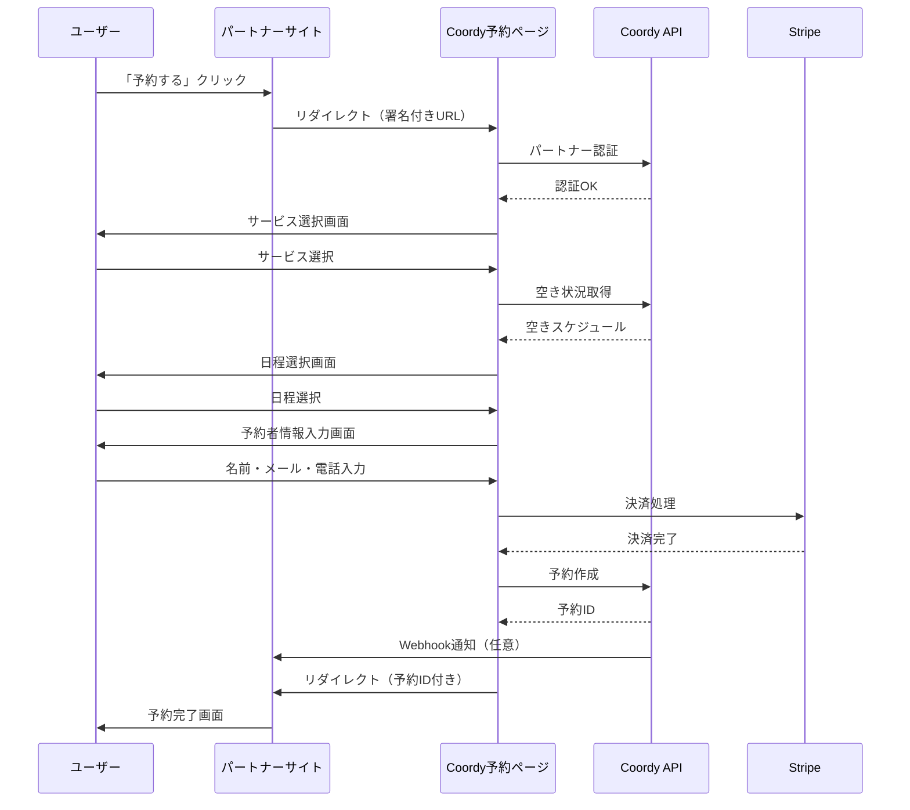
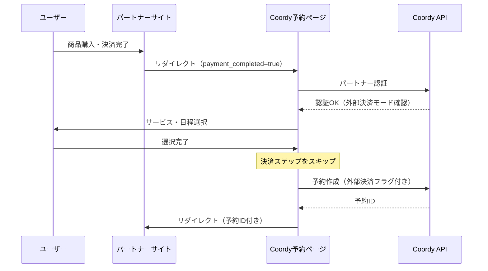

# 外部予約API連携 設計書

## 概要

外部のアクティビティサイトやパートナーサイトからCoordy予約システムへ連携するための設計書。
ユーザーは外部サイトの「予約する」ボタンからCoordy予約ページへ遷移し、サービス選択・日程選択・予約完了まで行える。

### 基本方針

- **優先パターン**: アクティビティ型（定員管理）を優先。将来的にレストラン型（席管理）にも拡張可能な設計
- **インストラクター概念**: 既存の個人レッスン機能は維持。内部的にはProvider（事業者）として拡張しやすい構造。画面表記は当面「インストラクター」
- **連携方式**: リダイレクト型を優先（MVP）。将来的にiframeウィジェットにも対応可能

## 目次

1. [アーキテクチャ概要](#1-アーキテクチャ概要)
2. [連携フロー](#2-連携フロー)
3. [データベース設計](#3-データベース設計)
4. [API設計](#4-api設計)
5. [フロントエンド設計](#5-フロントエンド設計)
6. [セキュリティ設計](#6-セキュリティ設計)
7. [パートナー管理](#7-パートナー管理)
8. [実装計画](#8-実装計画)

---

## 1. アーキテクチャ概要

### 1.1 連携方式

**リダイレクト型**を採用（MVP版）

| 方式 | 採用理由 |
|------|----------|
| リダイレクト型 | 既存の予約フロー・決済・認証をそのまま活用可能。実装コスト最小 |

### 1.2 システム構成図

```
┌─────────────────────────────────────────────────────────────────┐
│  外部パートナーサイト（アクティビティ事業者HP等）                    │
│                                                                 │
│  ┌─────────────────────────────────────────────────────────┐   │
│  │  「予約する」ボタン / リンク                               │   │
│  │                                                          │   │
│  │  URL例:                                                  │   │
│  │  https://coordy.com/book/external                       │   │
│  │    ?partner_id=ptr_xxxx                                 │   │
│  │    &service_id=svc_yyyy (任意)                          │   │
│  │    &instructor_id=ins_zzzz (任意)                       │   │
│  │    &date=2025-02-15 (任意)                              │   │
│  │    &return_url=https://partner.com/booking/complete     │   │
│  │    &external_ref=PARTNER-ORDER-123 (任意)               │   │
│  │    &ts=1707400000                                       │   │
│  │    &sig=abc123... (HMAC署名)                            │   │
│  └─────────────────────────────────────────────────────────┘   │
└─────────────────────────────────────────────────────────────────┘
                              │
                              ▼
┌─────────────────────────────────────────────────────────────────┐
│  Coordy 外部予約ページ (/book/external)                         │
│                                                                 │
│  Step 1: パートナー認証                                          │
│  ├── partner_id の存在確認                                      │
│  ├── 署名(sig)の検証                                            │
│  ├── タイムスタンプ(ts)の有効期限確認（5分以内）                    │
│  └── パートナーがアクティブか確認                                  │
│                                                                 │
│  Step 2: サービス選択                                            │
│  ├── service_id指定あり → そのサービスを表示                      │
│  ├── instructor_id指定あり → そのインストラクターのサービス一覧    │
│  └── 指定なし → パートナーに紐付いた全サービス                     │
│                                                                 │
│  Step 3: 日程選択                                                │
│  ├── date指定あり → その日付周辺を表示                           │
│  └── 指定なし → 直近の空き日程を表示                              │
│                                                                 │
│  Step 4: 予約者情報入力                                          │
│  ├── ログイン済み → 既存ユーザー情報を使用                        │
│  └── 未ログイン → ゲスト情報入力（名前・メール・電話）              │
│                                                                 │
│  Step 5: 決済                                                    │
│  ├── Coordy側決済 → 既存Stripe連携                              │
│  └── 外部決済済み → スキップ（payment_completed=true）           │
│                                                                 │
│  Step 6: 予約完了                                                │
│  ├── 予約データ作成                                              │
│  ├── ExternalReservation レコード作成                            │
│  ├── Webhook通知（設定がある場合）                                │
│  └── return_url へリダイレクト                                   │
└─────────────────────────────────────────────────────────────────┘
                              │
                              ▼
┌─────────────────────────────────────────────────────────────────┐
│  パートナーサイトへ戻る                                           │
│                                                                 │
│  リダイレクト先:                                                  │
│  https://partner.com/booking/complete                          │
│    ?status=success                                              │
│    &reservation_id=res_xxxxx                                   │
│    &external_ref=PARTNER-ORDER-123                             │
│    &sig=def456... (レスポンス署名)                               │
│                                                                 │
│  ※ステータス: success / cancelled / failed                      │
└─────────────────────────────────────────────────────────────────┘
```

### 1.3 主要機能

| 機能 | MVP対応 | 説明 |
|------|---------|------|
| リダイレクト型予約 | ○ | URLパラメータでサービス・日程を事前指定可能 |
| ゲスト予約 | ○ | アカウント登録なしで予約可能 |
| Coordy側決済 | ○ | 既存Stripe連携を使用 |
| 外部決済済み連携 | ○ | 決済完了フラグで決済をスキップ |
| パートナー管理 | ○ | Admin画面でAPIキー発行・管理 |
| Webhook通知 | ○ | 予約完了時にパートナーへ通知 |
| 埋め込みウィジェット | - | 将来対応 |
| 純粋API型 | - | 将来対応（大規模パートナー向け） |

---

## 2. 連携フロー

### 2.1 基本フロー（ゲスト予約・Coordy決済）



### 2.2 外部決済済みフロー



### 2.3 エラーハンドリング

| エラー種別 | 対応 |
|-----------|------|
| 無効なpartner_id | エラーページ表示、パートナーに戻るリンク |
| 署名検証失敗 | エラーページ表示（改ざん検知） |
| タイムスタンプ期限切れ | エラーページ表示（5分以上経過） |
| サービスが見つからない | サービス一覧ページへ遷移 |
| 空きがない | 別日程選択を促す |
| 決済失敗 | 再試行ページ表示 |
| 予約作成失敗 | エラーページ表示、return_urlへstatus=failed |

---

## 3. データベース設計

### 3.1 新規テーブル

#### Partner（パートナー管理）

```prisma
model Partner {
  id              String   @id @default(uuid())

  // 基本情報
  name            String                  // パートナー名（例: "アクティビティジャパン"）
  code            String   @unique        // パートナーコード（URL用、例: "activity-japan"）
  description     String?                 // 説明
  websiteUrl      String?                 // パートナーサイトURL
  logoUrl         String?                 // ロゴ画像URL

  // API認証
  apiKey          String   @unique        // APIキー（ptr_xxx形式）
  secretKey       String                  // HMAC署名用シークレット

  // Webhook設定
  webhookUrl      String?                 // 予約完了通知先URL
  webhookSecret   String?                 // Webhook署名用シークレット

  // CORS設定
  allowedOrigins  String[]                // 許可するオリジン（将来のウィジェット用）

  // 連携設定
  paymentMode     PaymentMode @default(COORDY)  // 決済モード
  allowGuest      Boolean     @default(true)    // ゲスト予約許可
  requirePhone    Boolean     @default(false)   // 電話番号必須

  // 紐付け制限（空の場合は制限なし）
  instructorIds   String[]                // 許可インストラクターID
  serviceIds      String[]                // 許可サービスID

  // 手数料設定
  commissionRate  Float       @default(0.0)     // 手数料率（0.0〜1.0）

  // ステータス
  isActive        Boolean     @default(true)

  // メタデータ
  metadata        Json?                   // 追加情報（自由形式）

  createdAt       DateTime    @default(now())
  updatedAt       DateTime    @updatedAt

  // リレーション
  externalReservations ExternalReservation[]

  @@index([apiKey])
  @@index([code])
}

enum PaymentMode {
  COORDY          // Coordy側で決済
  EXTERNAL        // 外部で決済済み
  BOTH            // 両方対応（リクエスト時に指定）
}
```

#### ExternalReservation（外部予約追跡）

```prisma
model ExternalReservation {
  id              String   @id @default(uuid())

  // 紐付け
  partnerId       String
  reservationId   String   @unique

  // 外部参照
  externalRef     String?                 // パートナー側の注文ID等

  // 決済情報
  paymentMode     PaymentMode             // 実際に使用した決済モード
  externalPaymentRef String?              // 外部決済の参照ID

  // 手数料
  commissionRate  Float                   // 適用された手数料率
  commissionAmount Int       @default(0)  // 手数料額（円）

  // メタデータ
  metadata        Json?                   // 追加情報

  createdAt       DateTime  @default(now())

  // リレーション
  partner         Partner     @relation(fields: [partnerId], references: [id])
  reservation     Reservation @relation(fields: [reservationId], references: [id])

  @@index([partnerId])
  @@index([externalRef])
}
```

#### GuestUser（ゲストユーザー）

```prisma
model GuestUser {
  id              String   @id @default(uuid())

  // 基本情報
  email           String
  name            String
  phoneNumber     String?

  // メタデータ
  metadata        Json?

  createdAt       DateTime @default(now())
  updatedAt       DateTime @updatedAt

  // リレーション
  reservations    Reservation[]

  @@index([email])
}
```

### 3.2 既存テーブル変更

#### Reservation（予約）への追加

```prisma
model Reservation {
  // ... 既存フィールド

  // ゲスト予約対応
  guestUserId     String?
  guestUser       GuestUser? @relation(fields: [guestUserId], references: [id])

  // 外部予約追跡
  externalReservation ExternalReservation?

  // userIdをオプショナルに変更（ゲスト予約対応）
  userId          String?   // 変更: String → String?
}
```

### 3.3 ER図

```
┌─────────────────┐       ┌─────────────────────┐
│    Partner      │       │  ExternalReservation │
├─────────────────┤       ├─────────────────────┤
│ id              │───┐   │ id                  │
│ name            │   │   │ partnerId       ────┼───┐
│ code            │   │   │ reservationId   ────┼───┼───┐
│ apiKey          │   │   │ externalRef         │   │   │
│ secretKey       │   │   │ paymentMode         │   │   │
│ webhookUrl      │   │   │ commissionRate      │   │   │
│ paymentMode     │   │   │ commissionAmount    │   │   │
│ allowGuest      │   │   └─────────────────────┘   │   │
│ instructorIds   │   │                             │   │
│ serviceIds      │   └─────────────────────────────┘   │
│ commissionRate  │                                     │
└─────────────────┘                                     │
                                                        │
┌─────────────────┐       ┌─────────────────┐          │
│   GuestUser     │       │   Reservation   │◄─────────┘
├─────────────────┤       ├─────────────────┤
│ id              │───┐   │ id              │
│ email           │   │   │ userId?         │───── User
│ name            │   │   │ guestUserId? ───┼───┐
│ phoneNumber     │   │   │ serviceId       │   │
└─────────────────┘   │   │ instructorId    │   │
                      │   │ scheduledAt     │   │
                      │   │ status          │   │
                      │   └─────────────────┘   │
                      │                         │
                      └─────────────────────────┘
```

---

## 4. API設計

### 4.1 外部連携用エンドポイント

#### GET /api/external/partner/verify

パートナー認証・URLパラメータ検証

**リクエスト（Query Parameters）**
```
partner_id: string    // パートナーID
ts: number           // タイムスタンプ（Unix秒）
sig: string          // HMAC-SHA256署名
service_id?: string  // サービスID（任意）
instructor_id?: string // インストラクターID（任意）
```

**レスポンス**
```json
{
  "valid": true,
  "partner": {
    "id": "ptr_xxxx",
    "name": "アクティビティジャパン",
    "logoUrl": "https://...",
    "paymentMode": "COORDY",
    "allowGuest": true
  },
  "restrictions": {
    "instructorIds": [],
    "serviceIds": []
  }
}
```

**エラーレスポンス**
```json
{
  "valid": false,
  "error": "INVALID_SIGNATURE" | "EXPIRED_TIMESTAMP" | "INACTIVE_PARTNER" | "INVALID_PARTNER"
}
```

---

#### GET /api/external/services

パートナー向けサービス一覧

**リクエスト（Query Parameters）**
```
partner_id: string       // パートナーID
instructor_id?: string   // インストラクターID絞り込み
category?: string        // カテゴリ絞り込み
```

**レスポンス**
```json
{
  "services": [
    {
      "id": "svc_xxxx",
      "title": "SUP体験コース",
      "description": "...",
      "instructor": {
        "id": "ins_yyyy",
        "name": "山田太郎",
        "image": "https://..."
      },
      "price": 5000,
      "duration": 120,
      "category": "water_sports",
      "images": ["https://..."],
      "deliveryType": "onsite",
      "location": "沖縄県那覇市..."
    }
  ]
}
```

---

#### GET /api/external/availability

空き状況確認

**リクエスト（Query Parameters）**
```
partner_id: string    // パートナーID
service_id: string    // サービスID
date_from: string     // 開始日（YYYY-MM-DD）
date_to: string       // 終了日（YYYY-MM-DD）
```

**レスポンス**
```json
{
  "serviceId": "svc_xxxx",
  "availability": [
    {
      "date": "2025-02-15",
      "slots": [
        {
          "scheduleId": "sch_001",
          "startTime": "09:00",
          "endTime": "11:00",
          "available": true,
          "remainingCapacity": 5
        },
        {
          "scheduleId": "sch_002",
          "startTime": "13:00",
          "endTime": "15:00",
          "available": true,
          "remainingCapacity": 3
        }
      ]
    },
    {
      "date": "2025-02-16",
      "slots": [
        {
          "scheduleId": "sch_003",
          "startTime": "09:00",
          "endTime": "11:00",
          "available": false,
          "remainingCapacity": 0
        }
      ]
    }
  ]
}
```

---

#### POST /api/external/reservations

予約作成（API型用・将来拡張）

**リクエストヘッダー**
```
X-Partner-Id: ptr_xxxx
X-Timestamp: 1707400000
X-Signature: abc123...
```

**リクエストボディ**
```json
{
  "serviceId": "svc_xxxx",
  "scheduleId": "sch_001",
  "scheduledAt": "2025-02-15T09:00:00+09:00",
  "participants": 2,
  "guest": {
    "email": "user@example.com",
    "name": "田中花子",
    "phoneNumber": "090-1234-5678"
  },
  "paymentMode": "EXTERNAL",
  "externalPaymentRef": "PAY-123456",
  "externalRef": "PARTNER-ORDER-789",
  "notes": "初心者です"
}
```

**レスポンス**
```json
{
  "success": true,
  "reservation": {
    "id": "res_xxxxx",
    "status": "CONFIRMED",
    "scheduledAt": "2025-02-15T09:00:00+09:00",
    "service": {
      "id": "svc_xxxx",
      "title": "SUP体験コース"
    },
    "totalAmount": 10000,
    "commission": 500
  }
}
```

---

#### POST /api/external/webhook/test

Webhook接続テスト

**リクエスト**
```json
{
  "partnerId": "ptr_xxxx"
}
```

**レスポンス**
```json
{
  "success": true,
  "webhookUrl": "https://partner.com/webhook",
  "responseStatus": 200,
  "responseTime": 150
}
```

---

### 4.2 Webhook通知

予約ステータス変更時にパートナーのwebhookUrlへPOST。
`reservation.created`（外部予約作成時）、`reservation.cancelled`（キャンセル時）、`reservation.completed`（完了時）の3イベントを送信。

**リトライ仕様**

| 項目 | 値 |
|------|-----|
| 最大リトライ回数 | 3回（初回 + リトライ3回 = 最大4回試行） |
| リトライ間隔 | 指数バックオフ（1秒→2秒→4秒 + ランダムジッター0〜1秒） |
| 最大待機時間 | 30秒 |
| タイムアウト | 10秒/リクエスト |
| リトライ対象 | 5xxエラー、ネットワークエラー |
| リトライ非対象 | 2xx（成功）、4xx（クライアントエラー） |

**配信ログ（WebhookLog）**

全てのWebhook送信結果はWebhookLogテーブルに永続化され、管理者画面から確認・手動再送が可能。

**リクエストヘッダー**
```
Content-Type: application/json
X-Coordy-Signature: sha256=xxxxx  // HMAC-SHA256署名
X-Coordy-Timestamp: 1707400000
```

**リクエストボディ**
```json
{
  "event": "reservation.created",
  "timestamp": "2025-02-08T12:00:00Z",
  "data": {
    "reservationId": "res_xxxxx",
    "externalRef": "PARTNER-ORDER-789",
    "status": "CONFIRMED",
    "service": {
      "id": "svc_xxxx",
      "title": "SUP体験コース"
    },
    "scheduledAt": "2025-02-15T09:00:00+09:00",
    "guest": {
      "name": "田中花子",
      "email": "user@example.com"
    },
    "totalAmount": 10000,
    "commission": 500,
    "paymentMode": "COORDY"
  }
}
```

**Webhookイベント種別**

| イベント | 送信タイミング | 説明 |
|---------|--------------|------|
| `reservation.created` | 外部予約作成時 | 予約作成完了 |
| `reservation.cancelled` | ユーザー/インストラクター/管理者によるキャンセル時 | 予約キャンセル |
| `reservation.completed` | インストラクター/管理者による完了時 | 予約完了（サービス提供完了） |

---

### 4.3 管理者用Webhook API

#### GET /api/admin/partners/[id]/webhooks

Webhook配信ログ一覧（Admin専用）

**クエリパラメータ**

| パラメータ | 型 | 説明 |
|-----------|-----|------|
| `page` | number | ページ番号（デフォルト: 1） |
| `limit` | number | 取得件数（デフォルト: 50、最大: 100） |
| `success` | boolean | 成功/失敗フィルタ |
| `event` | string | イベント名フィルタ |

**レスポンス**
```json
{
  "logs": [
    {
      "id": "xxx",
      "partnerId": "ptr_xxx",
      "reservationId": "res_xxx",
      "event": "reservation.created",
      "url": "https://partner.com/webhook",
      "requestBody": "{...}",
      "statusCode": 200,
      "success": true,
      "attempts": 1,
      "lastError": null,
      "lastAttemptAt": "2025-02-08T12:00:00Z",
      "createdAt": "2025-02-08T12:00:00Z"
    }
  ],
  "pagination": {
    "page": 1,
    "limit": 50,
    "total": 100,
    "totalPages": 2
  }
}
```

#### POST /api/admin/partners/[id]/webhooks/[logId]/retry

Webhook手動再送（Admin専用）

元のWebhookLogのペイロードを使って再送信し、新しいWebhookLogを作成。

**レスポンス**
```json
{
  "success": true,
  "statusCode": 200,
  "attempts": 1,
  "error": null
}
```

---

### 4.4 管理用エンドポイント

#### GET /api/admin/partners

パートナー一覧取得（Admin専用）

#### POST /api/admin/partners

パートナー作成

#### GET /api/admin/partners/[id]

パートナー詳細取得

#### PUT /api/admin/partners/[id]

パートナー更新

#### DELETE /api/admin/partners/[id]

パートナー削除（論理削除）

#### POST /api/admin/partners/[id]/regenerate-keys

APIキー再生成

---

## 5. フロントエンド設計

### 5.1 新規ページ

#### /book/external - 外部予約ページ

```
/book/external
├── ?partner_id=xxx&sig=xxx&ts=xxx (必須パラメータ)
├── ?service_id=xxx (任意: 特定サービス指定)
├── ?instructor_id=xxx (任意: 特定インストラクター指定)
├── ?date=2025-02-15 (任意: 日付指定)
├── ?return_url=https://... (任意: 戻り先URL)
├── ?external_ref=xxx (任意: 外部参照ID)
└── ?payment_completed=true (任意: 外部決済済みフラグ)
```

**コンポーネント構成**

```
/app/book/external/
├── page.tsx                    # メインページ
├── layout.tsx                  # 外部予約用レイアウト（シンプル版）
└── components/
    ├── PartnerHeader.tsx       # パートナーロゴ・名前表示
    ├── ServiceSelector.tsx     # サービス選択
    ├── ScheduleSelector.tsx    # 日程選択
    ├── GuestInfoForm.tsx       # ゲスト情報入力フォーム
    ├── PaymentSection.tsx      # 決済セクション
    ├── ConfirmationStep.tsx    # 確認画面
    └── CompletionStep.tsx      # 完了画面
```

**ステップフロー**

```typescript
type BookingStep =
  | 'loading'      // 初期化中
  | 'service'      // サービス選択
  | 'schedule'     // 日程選択
  | 'guest_info'   // 予約者情報入力
  | 'payment'      // 決済
  | 'confirmation' // 確認
  | 'complete'     // 完了
  | 'error';       // エラー
```

---

#### /admin/partners - パートナー管理ページ

```
/app/admin/partners/
├── page.tsx                    # パートナー一覧
├── [id]/
│   └── page.tsx               # パートナー詳細・編集
├── new/
│   └── page.tsx               # 新規パートナー作成
└── components/
    ├── PartnerList.tsx        # パートナー一覧テーブル
    ├── PartnerForm.tsx        # パートナー作成・編集フォーム
    ├── ApiKeyDisplay.tsx      # APIキー表示（コピー機能付き）
    ├── WebhookTester.tsx      # Webhook接続テスト
    └── ReservationStats.tsx   # 外部予約統計
```

---

### 5.2 共通コンポーネント

```typescript
// 外部予約用のシンプルなレイアウト
// ナビゲーション等を省略したミニマルデザイン

interface ExternalBookingLayoutProps {
  partner: Partner;
  children: React.ReactNode;
}

// パートナーブランディング表示
interface PartnerHeaderProps {
  partner: {
    name: string;
    logoUrl?: string;
  };
  showPoweredBy?: boolean;  // "Powered by Coordy" 表示
}
```

---

### 5.3 URL生成ヘルパー（パートナー向け）

パートナーが予約リンクを生成するためのサンプルコード

```typescript
// パートナー側で使用するURL生成関数
import crypto from 'crypto';

interface BookingUrlParams {
  partnerId: string;
  secretKey: string;
  serviceId?: string;
  instructorId?: string;
  date?: string;
  returnUrl?: string;
  externalRef?: string;
  paymentCompleted?: boolean;
}

function generateBookingUrl(params: BookingUrlParams): string {
  const baseUrl = 'https://coordy.com/book/external';

  const ts = Math.floor(Date.now() / 1000);

  const queryParams: Record<string, string> = {
    partner_id: params.partnerId,
    ts: ts.toString(),
  };

  if (params.serviceId) queryParams.service_id = params.serviceId;
  if (params.instructorId) queryParams.instructor_id = params.instructorId;
  if (params.date) queryParams.date = params.date;
  if (params.returnUrl) queryParams.return_url = params.returnUrl;
  if (params.externalRef) queryParams.external_ref = params.externalRef;
  if (params.paymentCompleted) queryParams.payment_completed = 'true';

  // 署名生成（partner_idとtsを署名対象に含める）
  const signaturePayload = `${params.partnerId}:${ts}`;
  const signature = crypto
    .createHmac('sha256', params.secretKey)
    .update(signaturePayload)
    .digest('hex');

  queryParams.sig = signature;

  const qs = new URLSearchParams(queryParams).toString();
  return `${baseUrl}?${qs}`;
}

// 使用例
const url = generateBookingUrl({
  partnerId: 'ptr_xxxx',
  secretKey: 'your_partner_secret_key',
  serviceId: 'svc_yyyy',
  date: '2025-02-15',
  returnUrl: 'https://partner.com/booking/complete',
  externalRef: 'ORDER-123',
});
```

---

## 6. セキュリティ設計

### 6.1 認証・認可

| レイヤー | 方式 | 説明 |
|---------|------|------|
| パートナー認証 | APIキー + HMAC署名 | URLパラメータの改ざん防止 |
| ユーザー認証 | Supabase Auth / ゲスト | 既存認証 or ゲスト情報 |
| Admin認証 | Supabase Auth + Role | 既存のAdmin認証 |

### 6.2 署名検証

```typescript
// Coordy側の署名検証関数
import crypto from 'crypto';

interface VerifySignatureParams {
  partnerId: string;
  timestamp: number;
  signature: string;
  secretKey: string;
}

function verifySignature(params: VerifySignatureParams): boolean {
  // タイムスタンプ有効期限チェック（5分）
  const now = Math.floor(Date.now() / 1000);
  if (now - params.timestamp > 300) {
    return false; // 期限切れ
  }

  // 署名検証
  const signaturePayload = `${params.partnerId}:${params.timestamp}`;
  const expectedSignature = crypto
    .createHmac('sha256', params.secretKey)
    .update(signaturePayload)
    .digest('hex');

  // タイミングセーフな比較
  return crypto.timingSafeEqual(
    Buffer.from(params.signature, 'hex'),
    Buffer.from(expectedSignature, 'hex')
  );
}
```

### 6.3 Webhook署名

```typescript
// Webhook送信時の署名生成
function signWebhookPayload(payload: object, secret: string): string {
  const body = JSON.stringify(payload);
  return crypto
    .createHmac('sha256', secret)
    .update(body)
    .digest('hex');
}

// パートナー側での検証
function verifyWebhookSignature(
  body: string,
  signature: string,
  secret: string
): boolean {
  const expected = crypto
    .createHmac('sha256', secret)
    .update(body)
    .digest('hex');

  return crypto.timingSafeEqual(
    Buffer.from(signature),
    Buffer.from(expected)
  );
}
```

### 6.4 セキュリティ要件

| 項目 | 対策 |
|------|------|
| APIキー漏洩 | 再生成機能、アクセスログ監視 |
| リプレイ攻撃 | タイムスタンプ検証（5分有効） |
| CSRF | 署名検証で防止 |
| XSS | Next.jsのデフォルト対策 |
| SQLインジェクション | Prismaのパラメータ化クエリ |
| レート制限 | 将来実装（IPベース + パートナーベース） |

---

## 7. パートナー管理

### 7.1 パートナー登録フロー

```
1. Admin画面で新規パートナー作成
   ├── 基本情報入力（名前、Webサイト等）
   ├── 連携設定（決済モード、ゲスト許可等）
   └── 制限設定（許可インストラクター/サービス）

2. APIキー・シークレットキー自動生成
   ├── APIキー: ptr_xxxxxxxxxxxxxxxx
   └── シークレット: sk_partner_xxxxxxxxxxxxxxxxxxxxxxxxxx

3. パートナーへ認証情報を共有
   ├── APIキー
   ├── シークレットキー
   ├── URL生成サンプルコード
   └── Webhook設定ガイド

4. パートナー側で実装
   ├── 予約リンク生成
   ├── Webhook受信エンドポイント構築
   └── テスト実施
```

### 7.2 Admin画面機能

| 機能 | 説明 |
|------|------|
| パートナー一覧 | 全パートナーの一覧表示、検索、フィルタ |
| パートナー作成 | 新規パートナー登録 |
| パートナー編集 | 設定変更、制限更新 |
| APIキー再生成 | セキュリティ上の理由での再生成 |
| Webhookテスト | 接続確認用テストリクエスト送信 |
| 予約統計 | パートナー経由の予約数・売上統計 |
| 無効化 | パートナーの一時停止/削除 |

### 7.3 手数料管理

```typescript
// 予約作成時の手数料計算
interface CommissionCalculation {
  totalAmount: number;      // 予約総額
  commissionRate: number;   // 手数料率（0.0〜1.0）
  commissionAmount: number; // 手数料額
  netAmount: number;        // 純売上（総額 - 手数料）
}

function calculateCommission(
  totalAmount: number,
  commissionRate: number
): CommissionCalculation {
  const commissionAmount = Math.floor(totalAmount * commissionRate);
  return {
    totalAmount,
    commissionRate,
    commissionAmount,
    netAmount: totalAmount - commissionAmount,
  };
}
```

---

## 8. 実装状況

### 8.1 フェーズ1: MVP（基本機能）- 実装済み

**対象機能**
- [x] Partnerモデル追加（Prismaスキーマ）
- [x] ExternalReservationモデル追加
- [x] GuestUserモデル追加
- [x] 既存Reservationモデル変更（guestUserId, participants追加）
- [x] パートナー認証ユーティリティ（lib/partner/auth.ts）
- [x] パートナー認証API（/api/external/partner/verify）
- [x] 外部サービス一覧API（/api/external/services）
- [x] 空き状況API（/api/external/availability）
- [x] 外部予約作成API（/api/external/reservations）
- [x] Webhook通知機能（lib/partner/webhook.ts）
- [x] 外部予約ページ（/book/external）ステップフロー実装
- [x] ゲスト情報入力フォーム
- [x] Admin パートナー管理API（CRUD + キー再生成）
- [x] Admin パートナー管理画面（/manage/admin/partners）
- [x] Admin パートナー詳細・編集画面

**実装ファイル一覧**
```
prisma/schema.prisma             # Partner, ExternalReservation, GuestUser モデル
lib/partner/auth.ts              # 署名生成・検証、APIキー生成
lib/partner/webhook.ts           # Webhook通知送信
lib/api/partners-client.ts       # パートナーAPIクライアント
app/api/external/partner/verify/ # パートナー認証API
app/api/external/services/       # サービス一覧API
app/api/external/availability/   # 空き状況API
app/api/external/reservations/   # 予約作成API
app/api/admin/partners/          # パートナー管理API（CRUD）
app/api/admin/partners/[id]/     # パートナー個別管理API
app/api/admin/partners/[id]/regenerate-keys/ # キー再生成API
app/book/external/layout.tsx     # 外部予約レイアウト
app/book/external/page.tsx       # 外部予約ページ（ステップフロー）
app/manage/(protected)/admin/partners/page.tsx      # パートナー一覧画面
app/manage/(protected)/admin/partners/[id]/page.tsx # パートナー詳細画面
```

### 8.2 フェーズ2: 拡張機能（次のステップ）

**対象機能**
- [ ] 手数料レポート・ダッシュボード
- [ ] キャンセル処理の外部連携
- [ ] リソース管理（席・部屋・機材管理）← レストラン型対応の基盤
- [ ] 予約確認メール自動送信（ゲスト宛）
- [ ] パートナー別予約統計

### 8.3 フェーズ3: 高度な機能（将来）

**対象機能**
- [ ] 埋め込みウィジェット（iframe）
- [ ] 純粋API型（外部UIからの直接予約）
- [ ] レート制限実装
- [ ] 多言語対応
- [ ] パートナーダッシュボード（パートナー自身がログイン）
- [ ] レストラン型リソース管理（テーブル・カウンター席管理）

---

## 付録

### A. URLパラメータ一覧

| パラメータ | 必須 | 説明 |
|-----------|------|------|
| `partner_id` | ○ | パートナーID |
| `ts` | ○ | タイムスタンプ（Unix秒） |
| `sig` | ○ | HMAC-SHA256署名 |
| `service_id` | - | 特定サービス指定 |
| `instructor_id` | - | 特定インストラクター指定 |
| `date` | - | 希望日付（YYYY-MM-DD） |
| `return_url` | - | 完了後の戻り先URL |
| `external_ref` | - | パートナー側の参照ID |
| `payment_completed` | - | 外部決済済みフラグ |

### B. エラーコード一覧

| コード | 説明 |
|--------|------|
| `INVALID_PARTNER` | パートナーIDが無効 |
| `INACTIVE_PARTNER` | パートナーが無効化されている |
| `INVALID_SIGNATURE` | 署名検証失敗 |
| `EXPIRED_TIMESTAMP` | タイムスタンプ期限切れ |
| `SERVICE_NOT_FOUND` | サービスが見つからない |
| `SERVICE_NOT_ALLOWED` | このパートナーでは予約不可のサービス |
| `NO_AVAILABILITY` | 空きがない |
| `PAYMENT_FAILED` | 決済失敗 |
| `RESERVATION_FAILED` | 予約作成失敗 |

### C. Webhook署名検証サンプル（Node.js）

```javascript
const crypto = require('crypto');

// Express.js ミドルウェア例
function verifyCoordyWebhook(req, res, next) {
  const signature = req.headers['x-coordy-signature'];
  const timestamp = req.headers['x-coordy-timestamp'];
  const body = JSON.stringify(req.body);

  // タイムスタンプ検証（5分以内）
  const now = Math.floor(Date.now() / 1000);
  if (now - parseInt(timestamp) > 300) {
    return res.status(401).json({ error: 'Timestamp expired' });
  }

  // 署名検証
  const expectedSig = 'sha256=' + crypto
    .createHmac('sha256', process.env.COORDY_WEBHOOK_SECRET)
    .update(body)
    .digest('hex');

  if (signature !== expectedSig) {
    return res.status(401).json({ error: 'Invalid signature' });
  }

  next();
}

// 使用例
app.post('/webhook/coordy', verifyCoordyWebhook, (req, res) => {
  const { event, data } = req.body;

  switch (event) {
    case 'reservation.created':
      console.log('New reservation:', data.reservationId);
      // 予約処理...
      break;
    case 'reservation.cancelled':
      console.log('Cancelled:', data.reservationId);
      // キャンセル処理...
      break;
  }

  res.json({ received: true });
});
```

---

## 更新履歴

| 日付 | バージョン | 内容 |
|------|-----------|------|
| 2025-02-08 | 1.0 | 初版作成 |
| 2025-02-08 | 1.1 | MVP実装完了、アクティビティ型優先・Provider概念反映 |
