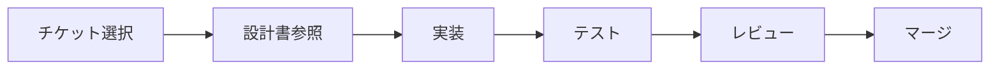

# 開発チケット管理

## 🚨 緊急バグ修正（Critical）

### TICKET-URGENT-001: TOPページ初回アクセス時に何も表示されない
**優先度**: 🔴 Critical
**ステータス**: ✅ 完了
**担当**: Frontend Developer

**現象**:
- https://localhost:3000/ にアクセスすると、画面全体がグラデーション背景だけの状態になる
- キャッチコピー、「レッスンを受けたい方」「講師・トレーナーの方」ボタンが一切表示されない

**期待する動作**:
- 初回アクセス時から、ヒーローセクションのテキストとボタンが即座に表示されること

**原因**:
- ✅ framer-motion の `initial={{ opacity: 0, y: 30 }}` により、アニメーションが発火しない場合にコンテンツが非表示のままになっていた

**対応内容**:
- ✅ `components/sections/HeroSection.tsx` の全motion.divの `initial` 属性を `opacity: 1, y: 0` に変更
- ✅ これにより、アニメーションが動作しない場合でもコンテンツが即座に表示される

**対応ファイル**:
- `components/sections/HeroSection.tsx` ✅ 修正完了

---

### TICKET-URGENT-002: Google Chrome から HTTP ERROR 431 でアクセス不可
**優先度**: 🔴 Critical
**ステータス**: ✅ ドキュメント化完了（ユーザー対応必要）
**担当**: Backend Developer

**現象**:
- Chrome から https://localhost:3000/ を開くと「HTTP ERROR 431」が発生
- 他ブラウザでは問題ない可能性

**原因**:
- ✅ リクエストヘッダまたはCookieのサイズが肥大化（431 = Request Header Fields Too Large）
- ✅ CognitoトークンやlocalStorageデータの蓄積によるもの

**対応内容**:
- ✅ `DOCS/TROUBLESHOOTING.md` に回避策を詳細にドキュメント化
- ✅ 3つの回避方法を記載：
  1. Chrome の Cookie とキャッシュをクリア（Ctrl + Shift + Delete）
  2. localStorage をDevToolsでクリア
  3. シークレットモードで動作確認（Ctrl + Shift + N）
- ✅ 開発サーバーのポート番号（3001）も記載

**今後の恒久対策**（別チケットで対応予定）:
- [ ] localStorage のデータ構造最適化
- [ ] セッション情報の圧縮
- [ ] Cookieサイズの削減

**対応ファイル**:
- `DOCS/TROUBLESHOOTING.md` ✅ 新規作成

---

### TICKET-URGENT-003: インストラクターログイン後に /user/profile/setup にリダイレクトされる
**優先度**: 🔴 Critical
**ステータス**: ✅ 完了
**担当**: Backend Developer

**現象**:
1. https://localhost:3000/ にアクセス
2. 右上「ログイン」→ ログインモーダル
3. 「講師・トレーナーとして」を選択してログイン
4. 一瞬 `/instructor` にアクセスするが、すぐに `/user/profile/setup` にリダイレクトされる

**期待する動作**:
- インストラクターとしてログインした場合は `/instructor` 配下だけで完結
- `/user/profile/setup` には絶対に飛ばされない

**原因**:
- ✅ `app/instructor/(protected)/layout.tsx` が古いlocalStorageベースの `getSession()` を使用していた
- ✅ localStorage のセッション情報が古く、正しいロールを反映していなかった

**対応内容**:
- ✅ `app/instructor/(protected)/layout.tsx` を修正
- ✅ `getSession()` と `hasRole()` を削除し、`getCurrentAuthUser()` に置き換え
- ✅ `getCurrentAuthUser()` はCognitoから最新のトークンを取得し、`cognito:groups` に基づいてロールを判定
- ✅ CREATORS グループ → instructor ロールの判定が正常に動作
- ✅ ロール確認後に `saveSession()` でlocalStorageを更新
- ✅ インストラクター以外のロールは適切なページへリダイレクト

**対応ファイル**:
- `app/instructor/(protected)/layout.tsx` ✅ 修正完了
- `lib/auth/cognito.ts` ✅ 既存の `getCurrentAuthUser()` を活用

---

### TICKET-URGENT-004: ユーザーログイン後に常に /user/profile/setup に飛び、保存もできない
**優先度**: 🔴 Critical
**ステータス**: ✅ 完了
**担当**: Backend Developer

**現象**:
1. https://localhost:3000/ にアクセス
2. 右上「ログイン」→ ログインモーダル
3. 「レッスンを受ける」を選択してログイン
4. 常に `/user/profile/setup` にリダイレクトされる
5. プロフィール入力後、「プロフィールの保存に失敗しました。もう一度お試しください。」エラーが出る

**期待する動作**:
- **すでに ClientProfile が存在する場合**: `/user` ダッシュボードに直接遷移
- **初回ログインでプロフィール未作成の場合のみ**: `/user/profile/setup` を表示
- プロフィール保存処理が正常に成功すること

**原因**:
- ✅ **問題1（常にリダイレクト）**: `app/user/(protected)/layout.tsx` が古いlocalStorageベースの `getSession()` を使用
- ✅ **問題2（保存失敗）**: `amplify/data/resource.ts` の ClientProfile が `allow.owner()` を使用していたが、`owner` フィールドが存在しなかった

**対応内容**:
- ✅ `app/user/(protected)/layout.tsx` を修正
  - `getSession()` と `hasRole()` を削除し、`getCurrentAuthUser()` に置き換え
  - Cognitoから最新のユーザー情報とロールを取得
  - プロフィール完了チェック（`isProfileComplete`）を正しい userId で実行
  - プロフィール未完了の場合のみ `/user/profile/setup` へリダイレクト
- ✅ `amplify/data/resource.ts` の ClientProfile 認可ルールを修正
  - `allow.owner()` → `allow.authenticated()` に変更
  - 認証済みユーザーであれば誰でも自分のプロフィールをCRUD可能に
  - Amplify sandboxで正常にデプロイ完了

**対応ファイル**:
- `app/user/(protected)/layout.tsx` ✅ 修正完了
- `amplify/data/resource.ts` ✅ 修正完了・デプロイ済み
- `lib/auth/cognito.ts` ✅ 既存の `getCurrentAuthUser()` を活用

---

### TICKET-URGENT-005: パスワードリセット機能の実装
**優先度**: 🔴 Critical
**ステータス**: ✅ 完了
**担当**: Frontend/Backend Developer

**現状**:
- ログイン画面（`/login/user`）にパスワードを忘れた場合の導線がない
- ユーザーが自分でパスワードをリセットできない

**要望**:
- ログインフォームの下に「パスワードをお忘れの方はこちら」リンクを追加
- パスワードリセット専用ページ（例：`/login/user/forgot`）を作成

**期待するフロー**:
1. メールアドレス入力
2. 「リセットメールを送信」ボタン押下
3. Cognito のパスワードリセット機能でメール送信
4. メールのリンクまたはコードで新しいパスワードを設定

**対応内容**:
- ✅ `/login/user` ページに「パスワードをお忘れの方はこちら」リンクを追加
- ✅ `/login/user/forgot` ページ作成（メールアドレス入力フォーム）
  - Cognito `resetPassword` API連携
  - エラーハンドリング（UserNotFoundException、LimitExceededException等）
  - 成功時に自動的にリセットページへ遷移
- ✅ `/login/user/reset` ページ作成（確認コード＋新しいパスワード入力）
  - Cognito `confirmResetPassword` API連携
  - パスワード要件バリデーション（8文字以上、大文字・小文字・数字）
  - 成功時に自動的にログインページへ遷移
- ✅ `DOCS/AUTHENTICATION_FLOW.md` に手順追記
  - パスワードリセットフローの図解
  - 確認手順
  - エラーハンドリング一覧

**対応ファイル**:
- `app/login/user/page.tsx` ✅ リンク追加
- `app/login/user/forgot/page.tsx` ✅ 新規作成
- `app/login/user/reset/page.tsx` ✅ 新規作成
- `DOCS/AUTHENTICATION_FLOW.md` ✅ パスワードリセットフロー追記

---

### TICKET-URGENT-006: プロフィール設定画面での電話番号二重入力と保存失敗
**優先度**: 🔴 Critical
**ステータス**: ✅ 完了
**担当**: Backend Developer

**現状**:
- サインアップ画面とプロフィール設定画面の両方で電話番号入力が存在（二重入力）
- プロフィール保存時に「プロフィールの保存に失敗しました。もう一度お試しください。」エラーが発生
- 保存が成功せず、`/user` に進めない

**要望**:
1. **電話番号の扱いの設計を整理**：
   - 「サインアップ時に電話番号を登録する」のか
   - 「プロフィール設定時に初めて電話番号を登録する」のか
   - どちらかに寄せるか、両方で扱う場合の設計を明確化
2. **プロフィール保存を必ず成功させる**：
   - どこで失敗しているか（APIエラー・バリデーション・認可など）を調査
   - 原因と修正内容をレポートに記載
3. **保存成功後は `/user` に遷移**

**根本原因**:
- ✅ **問題1（二重入力・連携なし）**: サインアップ時に入力した電話番号がCognitoに保存されるが、プロフィール設定画面で再度入力を求められていた
- ✅ **問題2（保存失敗）**: `app/user/profile/setup/page.tsx` が古いlocalStorageベースの `getSession()` を使用しており、正しい `userId` が取得できていなかった

**対応内容**:
- ✅ **電話番号設計の整理・ドキュメント化**：
  - サインアップ時：任意、Cognitoの`phone_number`属性に+81形式で保存
  - プロフィール設定時：必須、Cognitoから取得して初期値表示（0形式に変換）、ClientProfileに保存
  - `DOCS/PHONE_NUMBER_DESIGN.md` 新規作成
- ✅ **プロフィール設定画面を修正**：
  - `getSession()` を削除し、`getCurrentAuthUser()` と `fetchAuthSession()` に変更
  - Cognitoから最新のユーザー情報と電話番号を取得
  - 電話番号を+81形式から0形式に変換して初期値として表示
  - ユーザーは確認・編集するだけで済む（二重入力の解消）
  - 詳細なコンソールログを追加してデバッグ容易に
- ✅ **保存処理の修正**：
  - 正しい`userId`を使用してプロフィール作成・更新
  - エラーハンドリングを強化
  - 保存成功後は `/user` に遷移

**対応ファイル**:
- `app/user/profile/setup/page.tsx` ✅ 修正完了
  - `getCurrentAuthUser()` と `fetchAuthSession()` を使用
  - Cognitoから電話番号を取得して初期値に設定
  - プロフィール保存処理を修正
- `DOCS/PHONE_NUMBER_DESIGN.md` ✅ 新規作成
  - 電話番号の設計方針をドキュメント化
  - データフロー図を追加
  - バリデーションルール、UXパターンを記載

---

### TICKET-URGENT-007: 開発データリセット手順のドキュメント作成
**優先度**: 🟡 Medium
**ステータス**: ✅ 完了
**担当**: DevOps/Backend Developer

**背景**:
- 開発中にユーザーデータが古くなり、テストに影響が出る可能性
- 本番運用前なので、Cognitoユーザーや Amplify Data のデータを整理可能

**要望**:
- 「開発環境のユーザーデータをリセットする手順」を整理
- `DOCS/RESET-DEV-DATA.md` などにまとめる

**対応内容**:
- ✅ **包括的なドキュメント作成**：
  - Cognitoユーザーの削除手順（AWS CLI、コンソール）
  - Amplify Data（DynamoDB）のデータ削除手順（GraphQL、AWS CLI）
  - 完全リセット手順（Cognito + DynamoDB）
  - テストユーザー再作成スクリプト例
  - よくある質問セクション
  - トラブルシューティングセクション
- ✅ **実用的なスクリプト例**：
  - すべてのCognitoユーザーを一括削除するbashスクリプト
  - すべてのClientProfileを一括削除するGraphQLクエリ
  - テストユーザー作成の詳細手順
- ✅ **日本語で記載**：
  - すべての手順とコマンドを日本語で説明
  - 注意事項とベストプラクティスを明記

**対応ファイル**:
- `DOCS/RESET-DEV-DATA.md` ✅ 新規作成
  - Cognitoユーザー削除手順（単一・一括）
  - DynamoDBデータ削除手順
  - テストユーザー作成スクリプト
  - トラブルシューティングガイド

---

### TICKET-URGENT-008: インストラクターログイン後に /user/profile/setup にリダイレクトされる問題（再発）
**優先度**: 🔴 Critical
**ステータス**: ✅ 完了
**担当**: Backend Developer

**現象**（再現手順）:
1. https://localhost:3000/ にアクセス
2. 右上の「ログイン」クリック
3. ログインモーダルで「講師・トレーナーとして」を選択
4. インストラクター用のメールアドレス・パスワードでログイン
5. 一瞬 `/instructor` にアクセスした後、すぐに `/user/profile/setup` にリダイレクトされる

**懸念点**:
- ユーザーのセッションとインストラクターのセッションが混ざっている可能性
- `/user` と `/instructor` は本来別アカウント・別パスワードで運用する前提
- セッション・ロール判定・プロフィール判定の分離が不十分

**期待する仕様**:
- **インストラクターとしてログイン**：
  - `/instructor` 配下だけで完結
  - `/user/profile/setup` に飛ばされない
- **ユーザーとしてログイン**：
  - 既にプロフィールあり → `/user`
  - 初回ログインでプロフィール未作成 → `/user/profile/setup`

**根本原因**:
- ✅ `getSession()`はlocalStorageから古いユーザー情報を読み込むだけで、Cognitoの実際の認証状態を確認していなかった
- ✅ ユーザーとしてログイン後、ログアウトせずにインストラクターとしてログインすると、localStorageに古い`user`ロールが残る
- ✅ ログインページの`useEffect`で`getSession()`をチェック → 古い`user`ロールを検出 → `/user/profile/setup`にリダイレクト

**対応内容**:
- ✅ **ログインページのセッションチェックを修正**：
  - `getSession()`（localStorageのみ）→ `getCurrentAuthUser()`（Cognitoから最新情報取得）に変更
  - ログイン時に必ず最新のCognito認証情報を基にリダイレクト
- ✅ **ログイン処理の最初に`clearSession()`を追加**：
  - 新しいログイン時に古いlocalStorageセッションデータを完全にクリア
  - 別アカウント（user ⇔ instructor）でのログインをサポート
- ✅ **両方のログインページに適用**：
  - `app/login/user/page.tsx` - useEffectとhandleSubmitを修正
  - `app/login/instructor/page.tsx` - useEffectとhandleSubmitを修正

**対応ファイル**:
- `app/login/instructor/page.tsx` ✅ 修正完了
  - useEffectで`getCurrentAuthUser()`使用
  - handleSubmitの最初で`clearSession()`呼び出し
- `app/login/user/page.tsx` ✅ 修正完了
  - useEffectで`getCurrentAuthUser()`使用
  - handleSubmitの最初で`clearSession()`呼び出し
- `lib/auth/session.ts` ✅ 確認完了（既存の`clearSession()`を活用）
- `lib/auth/cognito.ts` ✅ 確認完了（既存の`getCurrentAuthUser()`を活用）

---

## 📊 実装状況サマリー

### ✅ 実装済み（既存コード）

| カテゴリ | 項目 | ステータス | ファイル |
|---------|------|----------|---------|
| **認証** | ログインページ | ✅ 完了 | `app/[role]/login/page.tsx` |
| **認証** | 認証フォーム | ✅ 完了 | `components/AuthForm.tsx` |
| **認証** | クライアント側ガード | ✅ 完了 | `components/ClientGuard.tsx` |
| **レイアウト** | ヘッダー | ✅ 完了 | `components/layout/AppHeader.tsx` |
| **レイアウト** | サイドバー | ✅ 完了 | `components/layout/Sidebar.tsx` |
| **カレンダー** | カレンダーコンポーネント | ✅ 完了 | `components/Calendar.tsx` |
| **ページ** | ユーザーダッシュボード | ✅ 完了 | `app/user/page.tsx` |
| **ページ** | サービス一覧 | ✅ 完了 | `app/user/services/page.tsx` |
| **ページ** | サービス詳細 | ✅ 完了 | `app/user/services/[id]/page.tsx` |
| **ページ** | 予約一覧 | ✅ 完了 | `app/user/reservations/page.tsx` |
| **ページ** | ToDo管理 | ✅ 完了 | `app/user/todos/page.tsx` |
| **ページ** | 支払い | ✅ 完了 | `app/user/payment/page.tsx` |
| **ページ** | 活動履歴 | ✅ 完了 | `app/user/activity/page.tsx` |
| **モック** | フェイクAPI | ✅ 完了 | `lib/fakeApi.ts` |
| **モック** | モックデータ | ✅ 完了 | `lib/mock.ts, lib/fitness-mock-data.ts` |

### 🚧 実装中・調整必要

| カテゴリ | 項目 | ステータス | 備考 |
|---------|------|----------|------|
| **API** | バックエンドAPI | 🚧 未実装 | モックAPIのみ、実APIが必要 |
| **データベース** | DynamoDB接続 | 🚧 未実装 | Amplify Gen2セットアップ必要 |
| **認証** | Cognito統合 | 🚧 未実装 | 現在はモック認証のみ |
| **決済** | Stripe統合 | 🚧 未実装 | 決済機能未実装 |
| **コンポーネント** | 予約フォーム | 🚧 改善必要 | UX改善・バリデーション強化 |

### ❌ 未実装（要開発）

| カテゴリ | 項目 | 優先度 |
|---------|------|--------|
| **インストラクター** | ダッシュボード | 🔴 高 |
| **インストラクター** | サービス管理 | 🔴 高 |
| **インストラクター** | スケジュール管理 | 🔴 高 |
| **管理者** | ダッシュボード | 🟡 中 |
| **管理者** | ユーザー管理 | 🟡 中 |
| **管理者** | サービス審査 | 🟡 中 |
| **通知** | リマインダー通知 | 🟢 低 |
| **EC** | 引換券システム | 🟢 低 |

---

## 🎯 開発チケット（Epic別）

### Epic 1: インフラ・環境構築 🏗️

#### TICKET-001: AWS Amplify Gen2セットアップ
**優先度**: 🔴 Critical
**見積**: 3日
**担当**: Backend Lead

**概要**:
AWS Amplify Gen2のセットアップとプロジェクト初期化

**タスク**:
- [ ] Amplify CLIインストール・設定
- [ ] プロジェクト初期化（`amplify init`）
- [ ] 環境変数設定（dev/staging/prod）
- [ ] IAMロール・ポリシー設定
- [ ] ドキュメント更新（SETUP.md）

**成果物**:
- Amplify設定ファイル
- 環境変数テンプレート
- セットアップドキュメント

**参照**: `DOCS/SETUP.md`, `DOCS/DEPLOYMENT.md`

---

#### TICKET-002: DynamoDBテーブル作成
**優先度**: 🔴 Critical
**見積**: 2日
**担当**: Backend Lead

**概要**:
DynamoDBテーブルの作成とGSI設定

**タスク**:
- [ ] Usersテーブル作成 + EmailIndex, RoleIndex
- [ ] Servicesテーブル作成 + CategoryIndex, StatusIndex
- [ ] Reservationsテーブル作成 + DateIndex, InstructorIndex, ServiceIndex
- [ ] Todosテーブル作成 + DateIndex, PriorityIndex
- [ ] Paymentsテーブル作成 + TypeIndex, DateIndex
- [ ] Instructorsテーブル作成 + UserIdIndex, StatusIndex
- [ ] 初期データ投入スクリプト作成

**成果物**:
- DynamoDBテーブル（全6テーブル）
- シードデータスクリプト
- テーブル設計ドキュメント更新

**参照**: `DOCS/DATABASE.md`

---

#### TICKET-003: Amazon Cognito認証設定
**優先度**: 🔴 Critical
**見積**: 2日
**担当**: Backend Lead

**概要**:
Cognitoユーザープールの作成と認証フロー実装

**タスク**:
- [ ] Cognitoユーザープール作成
- [ ] パスワードポリシー設定
- [ ] カスタム属性設定（role, userId）
- [ ] MFA設定（オプション）
- [ ] 認証フローの実装
- [ ] トークン管理の実装

**成果物**:
- Cognitoユーザープール
- 認証ライブラリ実装
- 認証フロー図

**参照**: `DOCS/AUTH.md`

---

#### TICKET-004: Stripe統合セットアップ
**優先度**: 🔴 High
**見積**: 3日
**担当**: Backend Lead

**概要**:
Stripe決済システムの統合とチャージ機能実装

**タスク**:
- [ ] Stripeアカウント作成・APIキー取得
- [ ] Stripe Checkout統合
- [ ] Webhookエンドポイント実装
- [ ] チャージフロー実装
- [ ] 決済履歴保存
- [ ] エラーハンドリング

**成果物**:
- Stripe統合コード
- Webhookハンドラー
- 決済テストケース

**参照**: `DOCS/API.md` (決済セクション)

---

### Epic 2: API実装 🔌

#### TICKET-005: 認証API実装
**優先度**: 🔴 Critical
**見積**: 2日
**担当**: Backend Developer

**概要**:
認証関連APIエンドポイントの実装

**エンドポイント**:
- [ ] `POST /api/auth/login` - ログイン
- [ ] `POST /api/auth/register` - ユーザー登録
- [ ] `POST /api/auth/logout` - ログアウト
- [ ] `POST /api/auth/refresh` - トークンリフレッシュ
- [ ] `POST /api/auth/verify` - メール確認

**成果物**:
- APIエンドポイント実装
- ユニットテスト
- APIドキュメント更新

**参照**: `DOCS/API.md` (認証セクション)

---

#### TICKET-006: ユーザーAPI実装
**優先度**: 🔴 High
**見積**: 2日
**担当**: Backend Developer

**概要**:
ユーザー情報管理APIの実装

**エンドポイント**:
- [ ] `GET /api/users/me` - 現在のユーザー情報取得
- [ ] `PATCH /api/users/me` - ユーザー情報更新
- [ ] `GET /api/users/:id` - ユーザー詳細取得（管理者）
- [ ] `GET /api/users` - ユーザー一覧取得（管理者）

**成果物**:
- APIエンドポイント実装
- ユニットテスト
- APIドキュメント更新

**参照**: `DOCS/API.md` (ユーザーセクション)

---

#### TICKET-007: サービスAPI実装
**優先度**: 🔴 High
**見積**: 3日
**担当**: Backend Developer

**概要**:
サービス（クラス）管理APIの実装

**エンドポイント**:
- [ ] `GET /api/services` - サービス一覧取得（フィルタ対応）
- [ ] `GET /api/services/:id` - サービス詳細取得
- [ ] `POST /api/services` - サービス作成（インストラクター/管理者）
- [ ] `PATCH /api/services/:id` - サービス更新
- [ ] `DELETE /api/services/:id` - サービス削除

**成果物**:
- APIエンドポイント実装
- ユニットテスト
- APIドキュメント更新

**参照**: `DOCS/API.md` (サービスセクション)

---

#### TICKET-008: 予約API実装
**優先度**: 🔴 Critical
**見積**: 3日
**担当**: Backend Developer

**概要**:
予約管理APIの実装

**エンドポイント**:
- [ ] `GET /api/reservations` - 予約一覧取得
- [ ] `POST /api/reservations` - 予約作成
- [ ] `GET /api/reservations/:id` - 予約詳細取得
- [ ] `PATCH /api/reservations/:id` - 予約キャンセル/変更
- [ ] `DELETE /api/reservations/:id` - 予約削除

**成果物**:
- APIエンドポイント実装
- 空き状況チェックロジック
- ユニットテスト

**参照**: `DOCS/API.md` (予約セクション)

---

#### TICKET-009: ToDo API実装
**優先度**: 🟡 Medium
**見積**: 2日
**担当**: Backend Developer

**概要**:
ToDo管理APIの実装

**エンドポイント**:
- [ ] `GET /api/todos` - ToDo一覧取得
- [ ] `POST /api/todos` - ToDo作成
- [ ] `PATCH /api/todos/:id` - ToDo更新
- [ ] `DELETE /api/todos/:id` - ToDo削除

**成果物**:
- APIエンドポイント実装
- ユニットテスト
- APIドキュメント更新

**参照**: `DOCS/API.md` (ToDoセクション)

---

#### TICKET-010: 支払いAPI実装
**優先度**: 🔴 High
**見積**: 3日
**担当**: Backend Developer

**概要**:
支払い・チャージAPIの実装

**エンドポイント**:
- [ ] `GET /api/payments` - 支払い履歴取得
- [ ] `POST /api/payments/charge` - チャージ（Stripe連携）
- [ ] `POST /api/payments/webhook` - Stripe Webhook

**成果物**:
- APIエンドポイント実装
- Stripe連携コード
- Webhookハンドラー

**参照**: `DOCS/API.md` (支払いセクション)

---

### Epic 3: フロントエンド強化 🎨

#### TICKET-011: 予約フォームUIリファクタリング
**優先度**: 🔴 High
**見積**: 2日
**担当**: Frontend Developer

**概要**:
予約フォームのUX改善とバリデーション強化

**タスク**:
- [ ] 日付選択UIの改善
- [ ] 時間帯選択UIの改善
- [ ] インストラクター選択UIの改善
- [ ] リアルタイムバリデーション実装
- [ ] エラーメッセージ改善
- [ ] ローディング状態の実装
- [ ] 確認ステップの追加

**成果物**:
- リファクタリング済みReservationFormコンポーネント
- バリデーションルール
- Storybookストーリー

**参照**: `DOCS/COMPONENTS.md` (予約関連)

---

#### TICKET-012: カレンダーコンポーネント強化
**優先度**: 🟡 Medium
**見積**: 3日
**担当**: Frontend Developer

**概要**:
カレンダーコンポーネントの機能拡張

**タスク**:
- [ ] 月/週/日ビュー切り替え実装
- [ ] イベントドラッグ&ドロップ
- [ ] 重複イベントの横並び表示
- [ ] イベントクリック詳細表示
- [ ] 今日ハイライト機能
- [ ] レスポンシブ対応

**成果物**:
- 強化版Calendarコンポーネント
- Storybookストーリー
- ユニットテスト

**参照**: `DOCS/COMPONENTS.md` (カレンダー関連)

---

#### TICKET-013: サービスカードコンポーネント実装
**優先度**: 🟡 Medium
**見積**: 1日
**担当**: Frontend Developer

**概要**:
サービス一覧用カードコンポーネントの実装

**タスク**:
- [ ] ServiceCardコンポーネント作成
- [ ] 画像表示・フォールバック処理
- [ ] カテゴリバッジ表示
- [ ] 価格・時間情報表示
- [ ] ホバーエフェクト実装
- [ ] レスポンシブ対応

**成果物**:
- ServiceCardコンポーネント
- Storybookストーリー
- スタイルガイド

**参照**: `DOCS/COMPONENTS.md` (サービス関連)

---

#### TICKET-014: ToDoリストコンポーネント実装
**優先度**: 🟡 Medium
**見積**: 2日
**担当**: Frontend Developer

**概要**:
ToDo管理UIの実装

**タスク**:
- [ ] TodoListコンポーネント作成
- [ ] TodoItemコンポーネント作成
- [ ] TodoFormコンポーネント作成
- [ ] 優先度別表示
- [ ] 完了/未完了フィルタ
- [ ] ドラッグ&ドロップ並び替え
- [ ] カレンダー統合

**成果物**:
- ToDoコンポーネント一式
- Storybookストーリー
- ユニットテスト

**参照**: `DOCS/COMPONENTS.md` (ToDo関連)

---

#### TICKET-015: 決済フローUI実装
**優先度**: 🔴 High
**見積**: 2日
**担当**: Frontend Developer

**概要**:
Stripeチャージフローの実装

**タスク**:
- [ ] PaymentFormコンポーネント作成
- [ ] Stripe Checkout統合
- [ ] チャージ金額入力UI
- [ ] 残高表示
- [ ] 決済履歴表示
- [ ] エラーハンドリング

**成果物**:
- 決済関連コンポーネント
- Stripe統合コード
- E2Eテスト

**参照**: `DOCS/COMPONENTS.md` (支払い関連)

---

### Epic 4: インストラクター機能 👩‍🏫

#### TICKET-016: インストラクターダッシュボード実装
**優先度**: 🔴 High
**見積**: 3日
**担当**: Frontend Developer

**概要**:
インストラクター向けダッシュボードの実装

**タスク**:
- [ ] ダッシュボードレイアウト作成
- [ ] 今日の予約一覧表示
- [ ] 収益サマリー表示（将来拡張）
- [ ] 顧客統計表示
- [ ] アクションカード実装

**成果物**:
- インストラクターダッシュボード
- サマリーコンポーネント
- ルーティング設定

**参照**: `DOCS/requirement.md` (インストラクター機能)

---

#### TICKET-017: サービス管理画面実装
**優先度**: 🔴 High
**見積**: 3日
**担当**: Frontend Developer

**概要**:
インストラクターのサービス管理画面実装

**タスク**:
- [ ] サービス一覧表示
- [ ] サービス作成フォーム
- [ ] サービス編集フォーム
- [ ] 価格・スケジュール設定
- [ ] 画像アップロード
- [ ] 公開/非公開切り替え

**成果物**:
- サービス管理画面
- CRUD機能一式
- バリデーション

**参照**: `DOCS/requirement.md` (サービス管理)

---

#### TICKET-018: スケジュール管理画面実装
**優先度**: 🔴 High
**見積**: 3日
**担当**: Frontend Developer

**概要**:
インストラクタースケジュール管理画面実装

**タスク**:
- [ ] カレンダービュー実装
- [ ] 空き時間設定機能
- [ ] 予約状況表示
- [ ] ブロック機能（休暇等）
- [ ] 繰り返し設定機能

**成果物**:
- スケジュール管理画面
- カレンダーコンポーネント拡張
- 設定保存機能

**参照**: `DOCS/requirement.md` (スケジュール管理)

---

#### TICKET-019: 顧客管理画面実装
**優先度**: 🟡 Medium
**見積**: 2日
**担当**: Frontend Developer

**概要**:
インストラクター顧客管理画面実装

**タスク**:
- [ ] 顧客一覧表示
- [ ] 顧客詳細表示
- [ ] 予約履歴表示
- [ ] メモ機能
- [ ] フィルタ・検索機能

**成果物**:
- 顧客管理画面
- 顧客詳細コンポーネント
- 検索機能

**参照**: `DOCS/requirement.md` (顧客管理)

---

### Epic 5: 管理者機能 👑

#### TICKET-020: 管理者ダッシュボード実装
**優先度**: 🟡 Medium
**見積**: 3日
**担当**: Frontend Developer

**概要**:
管理者向けダッシュボード実装

**タスク**:
- [ ] 全体統計表示
- [ ] ユーザー数推移グラフ
- [ ] 予約数推移グラフ
- [ ] 売上グラフ
- [ ] アラート表示

**成果物**:
- 管理者ダッシュボード
- グラフコンポーネント
- 統計API連携

**参照**: `DOCS/requirement.md` (管理者機能)

---

#### TICKET-021: ユーザー管理画面実装
**優先度**: 🟡 Medium
**見積**: 2日
**担当**: Frontend Developer

**概要**:
管理者向けユーザー管理画面実装

**タスク**:
- [ ] ユーザー一覧表示
- [ ] ユーザー詳細表示
- [ ] ロール変更機能
- [ ] アカウント停止機能
- [ ] 検索・フィルタ機能

**成果物**:
- ユーザー管理画面
- CRUD機能
- 権限チェック

**参照**: `DOCS/requirement.md` (ユーザー管理)

---

#### TICKET-022: サービス審査画面実装
**優先度**: 🟡 Medium
**見積**: 2日
**担当**: Frontend Developer

**概要**:
管理者向けサービス審査画面実装

**タスク**:
- [ ] 審査待ちサービス一覧
- [ ] サービス詳細表示
- [ ] 承認/却下機能
- [ ] コメント機能
- [ ] ステータス管理

**成果物**:
- サービス審査画面
- 審査ワークフロー
- 通知機能

**参照**: `DOCS/requirement.md` (サービス審査)

---

### Epic 6: テスト・品質 🧪

#### TICKET-023: ユニットテスト実装
**優先度**: 🔴 High
**見積**: 5日
**担当**: QA Engineer / Developer

**概要**:
主要コンポーネント・関数のユニットテスト実装

**タスク**:
- [ ] 認証関連テスト
- [ ] コンポーネントテスト（ServiceCard, Calendar等）
- [ ] ユーティリティ関数テスト
- [ ] APIクライアントテスト
- [ ] カバレッジ80%達成

**成果物**:
- テストスイート
- カバレッジレポート
- テストドキュメント

**参照**: `DOCS/requirement.md` (テスト要件)

---

#### TICKET-024: E2Eテスト実装
**優先度**: 🔴 High
**見積**: 4日
**担当**: QA Engineer

**概要**:
Playwrightを使用したE2Eテスト実装

**シナリオ**:
- [ ] ログイン→予約→完了フロー
- [ ] サービス検索・予約フロー
- [ ] チャージ→決済フロー
- [ ] ToDo追加→完了フロー
- [ ] エラーハンドリング

**成果物**:
- E2Eテストスイート
- テストレポート
- CI統合

**参照**: `DOCS/requirement.md` (テスト要件)

---

#### TICKET-025: アクセシビリティ対応
**優先度**: 🟡 Medium
**見積**: 3日
**担当**: Frontend Developer

**概要**:
WCAG 2.1 AA準拠のアクセシビリティ対応

**タスク**:
- [ ] セマンティックHTML修正
- [ ] ARIA属性追加
- [ ] キーボード操作対応
- [ ] スクリーンリーダー対応
- [ ] コントラスト比チェック
- [ ] axeツールでの検証

**成果物**:
- アクセシビリティ改善
- 検証レポート
- ガイドライン

**参照**: `DOCS/requirement.md` (アクセシビリティ)

---

### Epic 7: デプロイ・CI/CD 🚀

#### TICKET-026: GitHub Actions CI/CD構築
**優先度**: 🔴 High
**見積**: 2日
**担当**: DevOps Engineer

**概要**:
GitHub ActionsでのCI/CDパイプライン構築

**タスク**:
- [ ] Linter実行ワークフロー
- [ ] テスト実行ワークフロー
- [ ] ビルド実行ワークフロー
- [ ] デプロイワークフロー（Amplify）
- [ ] Slacks通知設定

**成果物**:
- CI/CDワークフロー
- デプロイ自動化
- 通知設定

**参照**: `DOCS/DEPLOYMENT.md`

---

#### TICKET-027: 環境別デプロイ設定
**優先度**: 🔴 High
**見積**: 2日
**担当**: DevOps Engineer

**概要**:
開発・ステージング・本番環境の設定

**タスク**:
- [ ] 環境別環境変数設定
- [ ] ブランチ戦略設定（develop/staging/main）
- [ ] プレビュー環境設定
- [ ] ロールバック手順整備

**成果物**:
- 環境別設定
- デプロイ手順書
- ロールバック手順書

**参照**: `DOCS/DEPLOYMENT.md`

---

#### TICKET-028: モニタリング・ログ設定
**優先度**: 🟡 Medium
**見積**: 2日
**担当**: DevOps Engineer

**概要**:
CloudWatch、Sentryでのモニタリング設定

**タスク**:
- [ ] CloudWatchログ設定
- [ ] Sentry統合
- [ ] アラート設定
- [ ] ダッシュボード作成

**成果物**:
- モニタリング設定
- アラートルール
- ダッシュボード

**参照**: `DOCS/DEPLOYMENT.md` (モニタリング)

---

## 📝 設計書の参照方法

### チケット作業時の参照指示

開発チケット作業時に設計書を参照したい場合、以下のように指示してください：

#### 1. **特定のドキュメントを参照**

```
@DOCS/requirement.md を見て、予約フローの要件を確認して
```

```
@DOCS/API.md のサービスAPIセクションを確認して実装して
```

```
@DOCS/COMPONENTS.md のServiceCard実装例を参照してコーディングして
```

#### 2. **複数ドキュメントを参照**

```
@DOCS/requirement.md と @DOCS/API.md を見て、予約機能を実装して
```

```
@DOCS/DATABASE.md と @DOCS/API.md を参照して、Reservationsテーブルのアクセスパターンを実装して
```

#### 3. **セクション指定で参照**

```
@DOCS/requirement.md の「ユーザーロール定義」セクションを見て、権限マトリックスを実装して
```

```
@DOCS/COMPONENTS.md の「予約フロー」セクションを参照して、ReservationFormを作成して
```

#### 4. **チケット番号で参照**

```
TICKET-011の要件に従って、予約フォームをリファクタリングして
```

```
TICKET-016を実装して。設計書も参照して
```

### 推奨される作業フロー



**作業例**:
```
1. 「TICKET-011を開始します。@DOCS/COMPONENTS.md と @DOCS/requirement.md を参照して予約フォームの要件を確認してください」
2. （実装）
3. 「実装完了したので、@DOCS/CONTRIBUTING.md のコーディング規約に従っているかレビューしてください」
```

---

## 🔄 チケットステータス管理

| ステータス | 説明 |
|----------|------|
| 📋 **TODO** | 未着手 |
| 🚧 **In Progress** | 作業中 |
| 👀 **Review** | レビュー待ち |
| ✅ **Done** | 完了 |
| ❌ **Blocked** | ブロック中 |

---

## 📊 進捗トラッキング

### Epic別進捗

| Epic | 完了 | 合計 | 進捗率 |
|------|------|------|--------|
| Epic 1: インフラ | 0 | 4 | 0% |
| Epic 2: API | 0 | 6 | 0% |
| Epic 3: フロントエンド | 0 | 5 | 0% |
| Epic 4: インストラクター | 0 | 4 | 0% |
| Epic 5: 管理者 | 0 | 3 | 0% |
| Epic 6: テスト | 0 | 3 | 0% |
| Epic 7: デプロイ | 0 | 3 | 0% |
| **合計** | **0** | **28** | **0%** |

---

---

## ログイン関連の改修作業

### TICKET-LOGIN-001: /login/user ログインボタン無反応の修正
**優先度**: 🔴 Critical
**ステータス**: ✅ 完了
**担当**: Backend Developer

**現象**:
- `/login/user` でメールアドレス・パスワード入力後、「ログイン」ボタンを押しても反応がない
- 認証処理が実行されず、画面遷移も発生しない

**期待する動作**:
- ボタンを押すとログイン処理が必ず実行される
- 認証成功時は `/user` または `/user/profile/setup` にリダイレクト
- エラー時は日本語エラーメッセージを表示

**対応内容**:
- ✅ 既存のログインフォームを確認
- ✅ 既に正しく実装されていることを確認（form onSubmit、button type="submit"、適切なエラーハンドリング）
- ✅ ログイン成功時のプロフィールチェックとリダイレクト処理が正常

**対応ファイル**:
- `app/login/user/page.tsx` ✅ 確認完了（既に正しく実装済み）

---

### TICKET-LOGIN-002: /signup/* をログインフローに統一
**優先度**: 🔴 Critical
**ステータス**: ✅ 完了
**担当**: Frontend Developer

**現象**:
- `/signup/user` に新規登録画面が存在
- `/signup/instructor` にクリエイター新規登録画面が存在
- ログインフローに統一したい

**期待する動作**:
- `/signup/user` → `/login/user` にリダイレクト
- `/signup/instructor` → `/login/instructor` にリダイレクト
- 既存のサインアップ画面を適切に整理

**対応内容**:
- ✅ `/signup/user` ページを完全に書き換え、`/login/user` へリダイレクトする実装に変更
- ✅ `/signup/instructor` ページを完全に書き換え、`/login/instructor` へリダイレクトする実装に変更
- ✅ リダイレクト中のローディング表示を実装（スピナーとメッセージ）
- ✅ `DOCS/AUTHENTICATION_FLOW.md` に v3.0 changelog を追加し、URLリダイレクトの仕様を明記

**対応ファイル**:
- `app/signup/user/page.tsx` ✅ 修正完了（リダイレクト実装）
- `app/signup/instructor/page.tsx` ✅ 修正完了（リダイレクト実装）
- `DOCS/AUTHENTICATION_FLOW.md` ✅ 更新完了（v3.0 changelog追加）

---

### TICKET-LOGIN-003: 管理者ログイン画面 /manage/login の実装
**優先度**: 🔴 Critical
**ステータス**: ✅ 完了
**担当**: Full-stack Developer

**現象**:
- `/manage/login` にアクセスすると 404 Not Found

**期待する動作**:
- 管理者用ログイン画面を実装
- admin ロールでログイン成功時は `/manage/admin` へ遷移
- admin 以外のロールはログイン後も管理画面にアクセス不可
- 未承認インストラクター一覧と承認/却下機能を提供

**前提条件**:
- 管理者アカウントはCognitoコンソールから手動作成
- 初期管理者: `admin` / `admin0001!`
- 一般UIからリンクを張らず、URL直打ちのみでアクセス

**対応内容**:
- ✅ `/manage/login` ページを新規作成（admin専用ログインフォーム実装）
  - admin ロール以外はエラーメッセージ表示
  - ログイン成功時に `/manage/admin` へリダイレクト
  - ダークテーマのデザイン適用（gray-900 グラデーション）
- ✅ `/manage/(protected)/layout.tsx` を新規作成（admin認証ガード実装）
  - `getCurrentAuthUser()` でロールチェック
  - admin以外は適切なページへリダイレクト
- ✅ `/manage/admin/page.tsx` を新規作成（インストラクター審査ダッシュボード実装）
  - 審査待ち・承認済み・却下・未提出の統計カード表示
  - 審査待ちインストラクター一覧テーブル
  - 全インストラクター一覧テーブル
  - 承認/却下ボタンによる `identityDocumentStatus` 更新機能
  - 却下時の理由入力プロンプト
  - 身分証明書URLの表示リンク

**対応ファイル**:
- `app/manage/login/page.tsx` ✅ 新規作成完了
- `app/manage/(protected)/layout.tsx` ✅ 新規作成完了
- `app/manage/(protected)/admin/page.tsx` ✅ 新規作成完了
- ビルド成功確認 ✅ 完了

---

*最終更新日: 2025-12-04*
