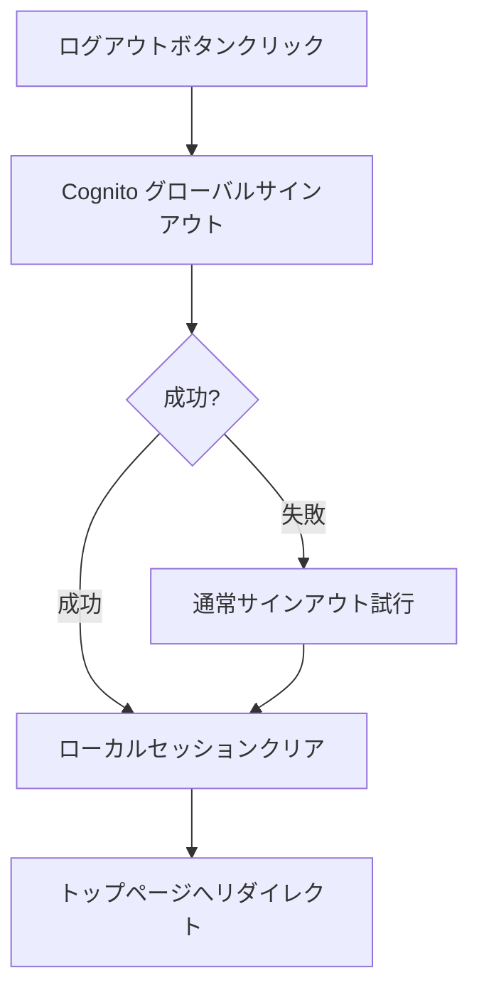
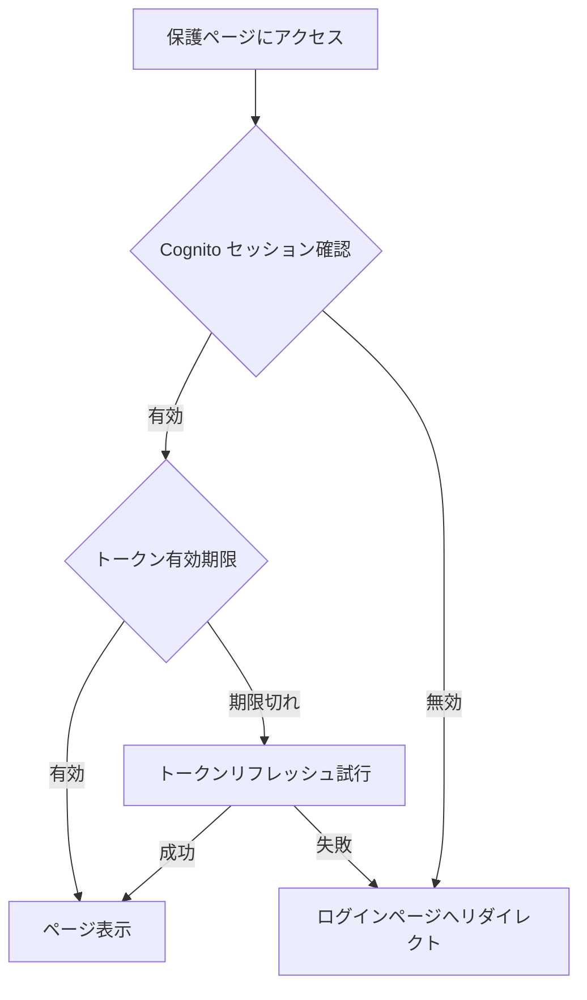

# ログイン / 認証フロー

最終更新: 2025-12-06

## 概要

Coordyでは、AWS Cognito（Amplify Gen2）を使用した認証システムを採用しています。
ユーザー、サービス出品者（instructorロール）、管理者の3つのロールに対応し、それぞれ専用のログインフローがあります。

---

## 1. ユーザー（クライアント）ログインフロー

### 1-1. 未登録ユーザー → 新規登録 → ログイン → /user

#### 概要
新規ユーザーがアカウントを作成し、メール確認を経てログインするまでのフロー。

#### 前提条件
- 有効なメールアドレスを保有していること
- パスワード要件を満たすパスワードを設定できること

#### 画面遷移ステップ
1. `/signup/user` にアクセス → `/login/user` へ自動リダイレクト
2. 「新規登録」リンクをクリック（ログイン画面内）
3. 登録フォームで以下を入力:
   - メールアドレス
   - パスワード（8文字以上、英数字含む）
   - ※名前はプロフィール設定画面で入力
4. 「登録」ボタンをクリック
5. Cognito がメールで確認コードを送信
6. `/verify` 画面で確認コードを入力
7. 確認成功 → `/login/user` にリダイレクト
8. ログイン情報を入力してログイン
9. プロフィール完了チェック:
   - 未完了 → `/user/profile/setup` へ
   - 完了 → `/user` へ

#### エラー / 例外パターン
- メールアドレスが既に登録済み → エラーメッセージ表示
- 確認コード有効期限切れ → コード再送信オプション
- パスワード要件不足 → バリデーションエラー

#### フロー図

```mermaid
flowchart TD
    A[/signup/user にアクセス] -->|v3.0〜| B[/login/user へリダイレクト]
    B --> C{アカウント有無}
    C -->|未登録| D[新規登録リンクをクリック]
    D --> E[登録フォーム入力]
    E --> F[Cognito に登録リクエスト]
    F --> G[確認コードメール送信]
    G --> H[/verify 画面]
    H --> I{確認コード入力}
    I -->|成功| J[/login/user へリダイレクト]
    I -->|失敗| K[エラー表示 / 再送信]
    K --> H
    J --> L[ログイン情報入力]
    L --> M{Cognito 認証}
    M -->|成功| N{プロフィール完了?}
    M -->|失敗| O[エラーメッセージ表示]
    O --> L
    N -->|未完了| P[/user/profile/setup]
    N -->|完了| Q[/user ダッシュボード]
    P --> R[初期設定入力]
    R --> Q
```

---

### 1-2. 登録済ユーザー → ログイン → /user

#### 概要
既にアカウントを持つユーザーが通常ログインするフロー。

#### 前提条件
- Cognito に登録済みのアカウント
- メール確認が完了していること

#### 画面遷移ステップ
1. `/login/user` にアクセス
2. メールアドレスとパスワードを入力
3. 「ログイン」ボタンをクリック
4. Cognito が認証を実行
5. 認証成功 → セッション保存
6. プロフィール完了チェック:
   - 未完了 → `/user/profile/setup` へ
   - 完了 → `/user` へ

#### エラー / 例外パターン
- パスワード間違い → 「メールアドレスまたはパスワードが正しくありません」
- アカウント未確認 → `/verify` へリダイレクト
- アカウント未登録 → 「このメールアドレスは登録されていません」

#### フロー図

```mermaid
flowchart TD
    A[/login/user にアクセス] --> B[ログイン情報入力]
    B --> C{Cognito 認証}
    C -->|成功| D{プロフィール完了?}
    C -->|未確認| E[/verify へリダイレクト]
    C -->|失敗| F[エラーメッセージ表示]
    F --> B
    E --> G[確認コード入力]
    G --> A
    D -->|未完了| H[/user/profile/setup]
    D -->|完了| I[/user ダッシュボード]
    H --> J[初期設定入力]
    J --> I
```

---

### 1-3. すでにログイン済ユーザーが /login/user にアクセスした場合

#### 概要
セッションが有効な状態でログインページにアクセスした場合の自動リダイレクト。
**重要**: ユーザーとしてログイン中の場合のみリダイレクトし、インストラクターログイン中は別途ユーザーアカウントを作成/ログインできるようにフォームを表示します。

#### 前提条件
- 有効な Cognito セッションが存在すること

#### 画面遷移ステップ
1. `/login/user` にアクセス
2. useEffect でセッションチェック実行
3. 有効なセッション検出
4. ロールに応じてリダイレクト:
   - user → `/user` または `/user/profile/setup`（リダイレクト）
   - instructor → **ログインフォームを表示**（別ロールでのログインを許可）
   - admin → `/admin`（リダイレクト）

#### フロー図

```mermaid
flowchart TD
    A[/login/user にアクセス] --> B{セッションチェック}
    B -->|有効| C{ロール判定}
    B -->|無効| D[ログインフォーム表示]
    C -->|user| E{プロフィール完了?}
    C -->|instructor| D
    C -->|admin| G[/admin へリダイレクト]
    E -->|完了| H[/user へリダイレクト]
    E -->|未完了| I[/user/profile/setup へリダイレクト]
```

---

### 1-4. パスワードリセットフロー

#### 概要
パスワードを忘れたユーザーがメール経由でパスワードを再設定するフロー。

#### 前提条件
- 登録済みのメールアドレス

#### 画面遷移ステップ
1. `/login/user` の「パスワードをお忘れの方」リンクをクリック
2. `/login/user/forgot` でメールアドレスを入力
3. Cognito がリセットコードをメール送信
4. `/login/user/reset` でコードと新パスワードを入力
5. パスワード更新成功 → `/login/user` へリダイレクト

#### フロー図

```mermaid
flowchart TD
    A[/login/user] --> B[パスワードをお忘れの方をクリック]
    B --> C[/login/user/forgot]
    C --> D[メールアドレス入力]
    D --> E[リセットコード送信]
    E --> F[/login/user/reset]
    F --> G[コードと新パスワード入力]
    G --> H{検証}
    H -->|成功| I[パスワード更新完了]
    H -->|失敗| J[エラー表示]
    J --> F
    I --> K[/login/user へリダイレクト]
```

---

## 2. サービス出品者（instructorロール）ログインフロー

### 2-1. 未登録サービス出品者 → 新規登録 → ログイン → /instructor

#### 概要
新規サービス出品者がアカウントを作成し、ログインするまでのフロー。
基本的な流れはユーザーと同様。

#### 前提条件
- 有効なメールアドレス
- サービス出品者としての登録意思

#### 画面遷移ステップ
1. `/signup/instructor` にアクセス → `/login/instructor` へ自動リダイレクト
2. 「新規登録」リンクをクリック
3. 登録情報を入力（メールアドレス＋パスワード、role: instructor として登録）
   - ※名前はプロフィール設定画面で入力
4. 確認コードメール送信
5. `/verify` で確認コード入力
6. 確認成功 → `/login/instructor` へリダイレクト
7. ログイン → プロフィール未作成なら `/instructor/profile/setup`、作成済みなら `/instructor` ダッシュボードへ

#### フロー図

```mermaid
flowchart TD
    A[/signup/instructor にアクセス] -->|v3.0〜| B[/login/instructor へリダイレクト]
    B --> C{アカウント有無}
    C -->|未登録| D[新規登録リンクをクリック]
    D --> E[登録フォーム入力<br/>role: instructor]
    E --> F[Cognito に登録]
    F --> G[確認コードメール送信]
    G --> H[/verify 画面]
    H --> I{確認コード入力}
    I -->|成功| J[/login/instructor へリダイレクト]
    I -->|失敗| K[エラー表示 / 再送信]
    K --> H
    J --> L[ログイン情報入力]
    L --> M{Cognito 認証}
    M -->|成功| N[/instructor ダッシュボード]
    M -->|失敗| O[エラーメッセージ表示]
    O --> L
```

---

### 2-2. 登録済サービス出品者 → ログイン → /instructor

#### 概要
既にアカウントを持つサービス出品者の通常ログイン。
**重要**: インストラクターとしてログイン中の場合のみリダイレクトし、ユーザーログイン中は別途インストラクターアカウントを作成/ログインできるようにフォームを表示します。

#### 画面遷移ステップ
1. `/login/instructor` にアクセス
2. セッションチェック
   - instructor ログイン中 → `/instructor` へリダイレクト
   - user ログイン中 → **ログインフォームを表示**（別ロールでのログインを許可）
   - 未ログイン → ログインフォームを表示
3. ログイン情報を入力
4. Cognito 認証
5. 認証成功 → インストラクタープロフィール有無をチェックし、未作成なら `/instructor/profile/setup`、作成済みなら `/instructor` へ

#### エラー / 例外パターン
- ロールが instructor でない → 「サービス出品者アカウントでログインしてください」

#### フロー図

```mermaid
flowchart TD
    A[/login/instructor にアクセス] --> B{セッションチェック}
    B -->|有効| C{ロール判定}
    B -->|無効| D[ログインフォーム表示]
    D --> E[ログイン情報入力]
    E --> F{Cognito 認証}
    F -->|成功| G{ロール確認}
    F -->|未確認| H[/verify へリダイレクト]
    F -->|失敗| I[エラーメッセージ表示]
    I --> D
    G -->|instructor| J[/instructor ダッシュボード]
    G -->|他ロール| K[ロールエラー表示]
    K --> D
    C -->|instructor| J
    C -->|user| D
    C -->|admin| M[/admin へリダイレクト]
```

---

## 3. 管理者ログインフロー

### 3-1. 管理者ログイン → /manage/admin

#### 概要
システム管理者専用のログインフロー。
管理者アカウントは事前に作成されている前提。

#### 前提条件
- admin ロールを持つ Cognito アカウント
- ADMINS グループに所属

#### 画面遷移ステップ
1. `/manage/login` にアクセス
2. セッションチェック:
   - 未ログイン → ログインフォームを表示
   - admin でログイン済み → `/manage/admin` へリダイレクト
   - **user/instructor でログイン済み → ログインフォームを表示**（管理者として別途ログイン可能）
3. 管理者認証情報を入力
4. Cognito 認証実行
5. ロールが admin であることを確認
6. 認証成功 → `/manage/admin` へリダイレクト

#### エラー / 例外パターン
- admin ロールでない → 「管理者アカウントでログインしてください」
- 認証失敗 → 標準エラーメッセージ
- 別アカウントでログイン中に管理者ログイン試行 → 「一度ログアウトしてから再度お試しください」
- user/instructor のまま `/manage/admin` にアクセス → `/manage/login?next=/manage/admin` へリダイレクトし、管理者ログインフォームを表示

#### フロー図

```mermaid
flowchart TD
    A[/manage/login にアクセス] --> B{セッションチェック}
    B -->|有効| C{ロール判定}
    B -->|無効| D[ログインフォーム表示]
    D --> E[管理者認証情報入力]
    E --> F{Cognito 認証}
    F -->|成功| G{ロール確認}
    F -->|失敗| H[エラーメッセージ表示]
    H --> D
    G -->|admin| I[/manage/admin ダッシュボード]
    G -->|他ロール| J[ロールエラー表示]
    J --> D
    C -->|admin| I
    C -->|user/instructor| D
```

---

## 4. ログアウトフロー

### 4-1. 全ロール共通のログアウト

#### 概要
各ダッシュボードからのログアウト処理。

#### 処理内容
1. ログアウトボタンをクリック
2. Cognito のグローバルサインアウトを実行
3. ローカルセッション（localStorage）をクリア
4. トップページ `/` またはログインページへリダイレクト

#### フロー図



---

## 5. セッション管理

### 5-1. セッション構造

```typescript
// localStorage に保存されるセッション情報
interface StoredSession {
  user: {
    userId: string;
    email: string;
    name: string;
    role: 'user' | 'instructor' | 'admin';
    emailVerified: boolean;
  };
  expiresAt: number; // Unix timestamp
}
```

### 5-2. セッションチェックフロー

各保護されたページで実行されるセッション検証:



---

## 6. ロール判定ロジック

### 6-1. Cognito グループベースのロール判定

```typescript
// IDトークンからロール判定
const groups = payload['cognito:groups'] || [];

if (groups.includes('ADMINS')) {
  role = 'admin';
} else if (groups.includes('CREATORS')) {
  role = 'instructor';
} else if (groups.includes('CLIENTS')) {
  role = 'user';
} else {
  // カスタム属性からフォールバック
  role = payload['custom:role'] || 'user';
}
```

### 6-2. ロールとグループの対応

| ロール | Cognito グループ | カスタム属性 | userType |
|--------|-----------------|--------------|----------|
| admin | ADMINS | admin | - |
| instructor | CREATORS | instructor | CREATOR |
| user | CLIENTS | user | CLIENT |

---

## 7. ログイン状態に応じたリダイレクト条件

### 7-1. 条件一覧表

各ログイン/サインアップページにアクセスした際の挙動を、ログイン状態別にまとめます。

| ログイン状態 | `/login/user` | `/signup/user` | `/login/instructor` | `/signup/instructor` |
|-------------|---------------|----------------|---------------------|----------------------|
| 未ログイン | フォーム表示 | フォーム表示 | フォーム表示 | フォーム表示 |
| ユーザーログイン中 | `/user` へリダイレクト | `/user` へリダイレクト | **フォーム表示** | **フォーム表示** |
| インストラクターログイン中 | **フォーム表示** | **フォーム表示** | `/instructor` へリダイレクト | `/instructor` へリダイレクト |
| 管理者ログイン中 | `/admin` へリダイレクト | `/admin` へリダイレクト | `/admin` へリダイレクト | `/admin` へリダイレクト |

**ポイント**:
- ユーザーとしてログイン中でも、インストラクター用ページ（`/login/instructor`, `/signup/instructor`）にはアクセス可能
- インストラクターとしてログイン中でも、ユーザー用ページ（`/login/user`, `/signup/user`）にはアクセス可能
- これにより、1人のユーザーが両方のロールのアカウントを持つことができる

### 7-2. トップページCTAボタンの遷移先

| ログイン状態 | 「ユーザーの新規登録はこちら」 | 「サービス出品者の新規登録はこちら」 |
|-------------|-------------------------------|-------------------------------------|
| 未ログイン | `/signup/user` | `/signup/instructor` |
| ユーザーログイン中 | `/user`（マイページへ） | `/signup/instructor` |
| インストラクターログイン中 | `/signup/user` | `/instructor`（マイページへ） |

### 7-3. フロー図（ログイン状態に応じたアクセス制御）

```mermaid
flowchart TD
    subgraph ログイン状態チェック
        A[ページアクセス] --> B{セッション確認}
        B -->|無効| C[フォーム表示]
        B -->|有効| D{現在のロール}
    end

    subgraph ユーザー用ページ
        D -->|user| E[/user へリダイレクト]
        D -->|instructor| F[フォーム表示<br/>別ロールでのログイン許可]
        D -->|admin| G[/admin へリダイレクト]
    end

    subgraph インストラクター用ページ
        D -->|user| H[フォーム表示<br/>別ロールでのログイン許可]
        D -->|instructor| I[/instructor へリダイレクト]
        D -->|admin| J[/admin へリダイレクト]
    end
```

---

## 8. サービス出品者パスワードリセットフロー

### 8-1. パスワードリセット手順

#### 概要
サービス出品者がパスワードを忘れた場合のリセットフロー。

#### 画面遷移ステップ
1. `/login/instructor` の「パスワードをお忘れの方はこちら」リンクをクリック
2. `/login/instructor/forgot` でメールアドレスを入力
3. Cognito がリセットコードをメール送信
4. `/login/instructor/reset` でコードと新パスワードを入力
5. パスワード更新成功 → `/login/instructor` へリダイレクト

#### フロー図

```mermaid
flowchart TD
    A[/login/instructor] --> B[パスワードをお忘れの方をクリック]
    B --> C[/login/instructor/forgot]
    C --> D[メールアドレス入力]
    D --> E[リセットコード送信]
    E --> F[/login/instructor/reset]
    F --> G[コードと新パスワード入力]
    G --> H{検証}
    H -->|成功| I[パスワード更新完了]
    H -->|失敗| J[エラー表示]
    J --> F
    I --> K[/login/instructor へリダイレクト]
```

---

## 9. セッション制約と注意事項

### 9-1. 1ブラウザセッションでの自動セッション切替

#### 仕様の説明
AWS Cognito/Amplify の仕様により、**1つのブラウザセッションで複数の Cognito アカウントを同時にログインすることはできません**。
ただし、**別ロールでのログインを試みた場合は、システムが自動的にセッションを切り替えます**。

#### 動作シナリオ
- ユーザーとしてログイン中に、インストラクターアカウントでログインしようとした場合:
  1. システムが自動的に現在のセッション（ユーザー）をサインアウト
  2. 新しい認証情報（インストラクター）でサインイン
  3. ユーザーにはシームレスにログインが完了

- インストラクターとしてログイン中に、ユーザーアカウントでログインしようとした場合も同様

#### 技術的実装
`lib/auth/cognito.ts` の `loginUser` 関数で、`UserAlreadyAuthenticatedException` を検知した際に:
1. 自動的に `signOut()` を実行
2. 同じ認証情報で `signIn()` をリトライ
3. 成功したら通常通りセッションを保存してリダイレクト

```typescript
// 既に別アカウントでログイン中の場合、自動的にサインアウトしてリトライ
if (isAlreadySignedIn) {
  await signOut();
  return await attemptSignIn();
}
```

#### ユーザー体験
- **エラーメッセージは表示されない**
- ログインボタンを押すだけで、シームレスにセッションが切り替わる
- ユーザーは手動でログアウトする必要がない

#### 技術的背景
- Cognito はブラウザの localStorage にセッション情報を保存
- 同一オリジンでは1つのアクティブセッションのみ保持可能
- システムが自動的にセッション切替を行うことで、UX を向上

---

## 10. 不明点・要確認事項

### 実装済みだが詳細不明な点
- [ ] MFA（2段階認証）の有効化タイミングと設定フロー
- [ ] 管理者アカウントの初期作成プロセス（CLI/コンソール経由?）
- [ ] サービス出品者の本人確認書類フローとログインの関係

### 将来実装予定
- [ ] ソーシャルログイン（Google、Apple等）の追加
- [ ] MFA の必須化オプション
- [ ] パスワードポリシーのカスタマイズ

### 確認が必要な仕様
- [ ] セッション有効期限の具体的な値
- [ ] リフレッシュトークンの有効期間
- [ ] 同時ログイン数の制限有無
