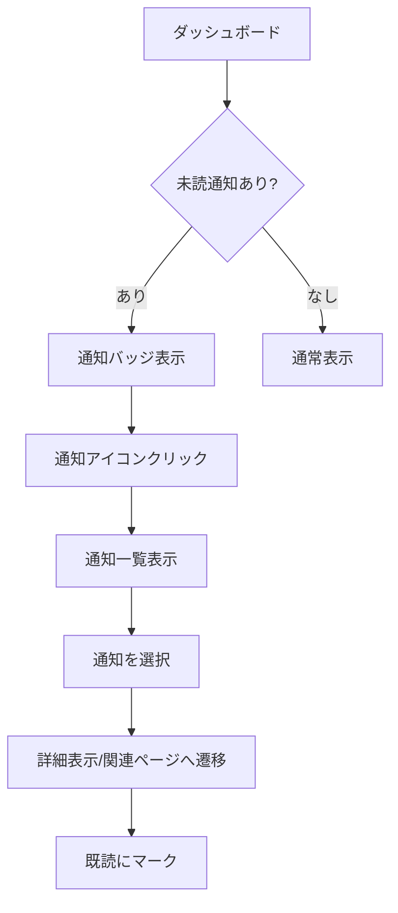

# 主要ユーザーフロー

最終更新: 2025-12-06

## 概要

このドキュメントでは、Coordy における主要なユーザーフローを整理しています。
ログイン・認証フローについては `DOCS/flows/login-flow.md` を参照してください。

---

## 1. クライアント（ユーザー）向けフロー

### 1-1. サービス検索 → 詳細確認 → 予約

#### 概要
クライアントがサービスを探し、詳細を確認して予約を完了するまでのフロー。

#### 前提条件
- ログイン済みであること（role: user）
- プロフィール初期設定が完了していること

#### 画面遷移ステップ
1. `/user` ダッシュボードにアクセス
2. 「サービスを探す」または `/user/services` に移動
3. 検索条件を入力（カテゴリ、日時、場所など）
4. 一覧から気になるサービスを選択
5. `/user/services/[id]` でサービス詳細を確認
6. 「予約する」ボタンをクリック
7. 予約日時・人数などを選択
8. 支払い情報を入力（Stripe 連携）
9. 予約確認画面で内容を確認
10. 「予約を確定」ボタンをクリック
11. 予約完了 → 確認メール送信
12. `/user/reservations` で予約一覧に表示

#### エラー / 例外パターン
- 選択した日時が既に埋まっている → 別の日時を選択
- 決済失敗 → 支払い情報の再入力
- インストラクターがサービスを停止 → 予約不可メッセージ

#### フロー図

```mermaid
flowchart TD
    A[/user ダッシュボード] --> B[サービスを探す]
    B --> C[/user/services 一覧]
    C --> D[検索条件入力]
    D --> E[サービス一覧表示]
    E --> F[サービス選択]
    F --> G[/user/services/id 詳細]
    G --> H{予約する?}
    H -->|はい| I[予約日時選択]
    H -->|いいえ| J[お気に入りに追加]
    J --> K[/user/favorites]
    I --> L{空き確認}
    L -->|空きあり| M[支払い情報入力]
    L -->|満席| N[別日時を選択]
    N --> I
    M --> O[予約確認画面]
    O --> P{確定する?}
    P -->|はい| Q[Stripe 決済処理]
    P -->|いいえ| I
    Q --> R{決済成功?}
    R -->|成功| S[予約完了]
    R -->|失敗| T[エラー表示]
    T --> M
    S --> U[確認メール送信]
    U --> V[/user/reservations]
```

---

### 1-2. 予約一覧からのキャンセル

#### 概要
予約済みのサービスをキャンセルするフロー。

#### 前提条件
- ログイン済みであること
- キャンセル可能な予約が存在すること
- キャンセルポリシーの期限内であること

#### 画面遷移ステップ
1. `/user/reservations` にアクセス
2. キャンセルしたい予約を選択
3. 「キャンセル」ボタンをクリック
4. キャンセル理由を選択（任意）
5. キャンセルポリシーを確認
6. 「キャンセルを確定」ボタンをクリック
7. 返金処理（キャンセルポリシーに基づく）
8. キャンセル完了メール送信
9. 予約一覧から削除

#### キャンセルポリシー（例）
| タイミング | 返金率 |
|-----------|--------|
| 7日前まで | 100% |
| 3日前まで | 50% |
| 前日まで | 25% |
| 当日 | 0% |

※ 実際のポリシーはサービスごとに異なる可能性あり

#### フロー図

```mermaid
flowchart TD
    A[/user/reservations] --> B[予約一覧表示]
    B --> C[キャンセルしたい予約を選択]
    C --> D{キャンセル可能?}
    D -->|不可| E[キャンセル不可メッセージ]
    D -->|可能| F[キャンセルボタンクリック]
    F --> G[キャンセル理由選択]
    G --> H[キャンセルポリシー表示]
    H --> I{確定する?}
    I -->|いいえ| B
    I -->|はい| J[キャンセル処理]
    J --> K{返金対象?}
    K -->|対象| L[Stripe 返金処理]
    K -->|対象外| M[返金なし]
    L --> N[キャンセル完了]
    M --> N
    N --> O[確認メール送信]
    O --> P[予約一覧更新]
```

---

### 1-3. お気に入り管理フロー

#### 概要
気になるサービスをお気に入りに追加・削除するフロー。

#### 画面遷移ステップ
1. サービス詳細画面でハートアイコンをクリック
2. お気に入りに追加/削除
3. `/user/favorites` で一覧確認

#### フロー図

```mermaid
flowchart TD
    A[サービス詳細画面] --> B{お気に入り済み?}
    B -->|いいえ| C[ハートアイコンクリック]
    B -->|はい| D[ハートアイコンクリック]
    C --> E[お気に入りに追加]
    D --> F[お気に入りから削除]
    E --> G[/user/favorites に反映]
    F --> G
```

---

### 1-4. プロフィール設定フロー

#### 概要
ユーザーがプロフィール情報を設定・更新するフロー。
設定した「表示名」は `/user` ダッシュボードの挨拶文とヘッダーメニューに反映される。

#### 表示名の解決ロジック
`lib/auth/displayName.ts` の `resolveDisplayName()` 関数により、以下の優先順位で表示名が決定される:

1. **ClientProfile.displayName** - ニックネーム（任意）
2. **ClientProfile.name** - 氏名（必須）
3. **Cognito displayName** - Cognito のカスタム属性 `custom:displayName`
4. **Cognito name** - Cognito に保存された名前
5. **メールアドレスのローカル部** - 上記がすべて空の場合のフォールバック
6. **「ゲスト」** - 最終フォールバック

```typescript
export function resolveDisplayName(
  user: Pick<User, 'email' | 'name' | 'displayName'>,
  profile?: ProfileLike
): string {
  // プロフィールから表示名を取得
  // ClientProfile / Instructor 両方に displayName が存在するため、まず displayName をチェック
  const profileDisplayName = (profile?.displayName || '').trim();
  if (profileDisplayName) return profileDisplayName;

  // displayName がない場合は name を使用
  const profileName = (profile?.name || '').trim();
  if (profileName) return profileName;

  // Cognito の custom:displayName から取得
  const cognitoDisplayName = (user.displayName || '').trim();
  if (cognitoDisplayName) return cognitoDisplayName;

  // Cognito の name から取得
  const cognitoName = (user.name || '').trim();
  if (cognitoName) return cognitoName;

  // メールアドレスのローカル部（最後のフォールバック）
  const emailLocal = (user.email || '').split('@')[0]?.trim();
  return emailLocal || 'ゲスト';
}
```

#### 画面遷移ステップ
1. `/user/profile/setup` にアクセス（初回設定）または `/user/profile` にアクセス（編集）
2. 「編集」ボタンをクリック（プロフィール設定画面では不要）
3. 各項目を入力/変更:
   - 氏名（必須）
   - 表示名（ニックネーム、任意）
   - 住所（必須）
   - 電話番号（必須）
   - 生年月日（任意）
   - 性別（任意）
4. 「プロフィールを保存」ボタンをクリック
5. 変更内容が反映（ヘッダー、ダッシュボード挨拶文に即時反映）

初期表示では氏名・表示名の入力欄は空欄（メールアドレスのローカル部は使用しない）。既存プロフィールがある場合のみ保存済みの値を表示する。

#### フロー図

```mermaid
flowchart TD
    A[/user/profile] --> B[プロフィール表示]
    B --> C[編集ボタンクリック]
    C --> D[編集フォーム表示]
    D --> E[各項目を入力/変更]
    E --> F[保存ボタンクリック]
    F --> G{バリデーション}
    G -->|成功| H[プロフィール更新]
    G -->|失敗| I[エラー表示]
    I --> E
    H --> J[成功メッセージ表示]
    J --> B
```

---

## 2. インストラクター（サービス提供者）向けフロー

### 2-1. サービス登録フロー

#### 概要
インストラクターが新しいサービスを登録するフロー。

#### 前提条件
- ログイン済みであること（role: instructor）
- 本人確認が完了していること（推奨）

#### 画面遷移ステップ
1. `/instructor` ダッシュボードにアクセス
2. 「新規サービス作成」ボタンをクリック
3. サービス基本情報を入力:
   - タイトル
   - カテゴリ
   - 説明文
   - 料金
   - 所要時間
   - 定員
4. スケジュール設定
5. 画像アップロード（S3 連携）
6. プレビュー確認
7. 「公開する」ボタンをクリック
8. サービス公開完了

#### フロー図

```mermaid
flowchart TD
    A[/instructor ダッシュボード] --> B[新規サービス作成]
    B --> C[サービス基本情報入力]
    C --> D[タイトル・説明入力]
    D --> E[料金・時間設定]
    E --> F[スケジュール設定]
    F --> G[画像アップロード]
    G --> H[S3 にアップロード]
    H --> I[プレビュー確認]
    I --> J{公開する?}
    J -->|はい| K[サービス公開]
    J -->|いいえ| L[下書き保存]
    K --> M[公開完了メッセージ]
    L --> N[下書き一覧]
```

---

### 2-2. 予約確認・承認フロー

#### 概要
クライアントからの予約をインストラクターが確認・管理するフロー。

#### 画面遷移ステップ
1. `/instructor` ダッシュボードにアクセス
2. 新着予約通知を確認
3. 予約詳細を表示
4. 予約内容を確認（日時、人数、クライアント情報）
5. 必要に応じてクライアントにメッセージ送信
6. レッスン当日に実施

#### フロー図

```mermaid
flowchart TD
    A[/instructor ダッシュボード] --> B{新着予約あり?}
    B -->|あり| C[予約通知表示]
    B -->|なし| D[予約カレンダー表示]
    C --> E[予約詳細確認]
    E --> F[クライアント情報確認]
    F --> G{対応可能?}
    G -->|可能| H[予約確定]
    G -->|不可| I[キャンセル依頼]
    H --> J[確認メール送信]
    I --> K[キャンセル処理]
    J --> L[カレンダーに反映]
    K --> L
```

---

### 2-3. 本人確認書類提出フロー

#### 概要
インストラクターが本人確認のために身分証明書を提出するフロー。

#### 前提条件
- インストラクターとして登録済み
- 有効な身分証明書を保有

#### 画面遷移ステップ
1. `/instructor/(protected)/identity-document` にアクセス
2. 提出ガイドラインを確認
3. 身分証明書の写真をアップロード
4. 提出完了 → 審査待ち状態
5. 管理者による審査
6. 審査結果通知（メール/アプリ内）

#### フロー図

```mermaid
flowchart TD
    A[/instructor ダッシュボード] --> B[本人確認メニュー]
    B --> C[/instructor/.../identity-document]
    C --> D[提出ガイドライン確認]
    D --> E[身分証明書撮影/選択]
    E --> F[画像アップロード]
    F --> G[S3 にアップロード]
    G --> H[提出完了]
    H --> I[審査待ち状態]
    I --> J{管理者審査}
    J -->|承認| K[本人確認完了]
    J -->|却下| L[再提出依頼]
    K --> M[完了通知メール]
    L --> N[却下理由通知]
    N --> E
```

### 2-4. インストラクタープロフィール初期設定フロー

#### 概要
インストラクターとして初回ログイン後に表示名などの基本プロフィールを登録するフロー。  
プロフィールが未作成の場合は `/instructor/profile/setup` に誘導され、完了すると `/instructor` ダッシュボードへ遷移する。

#### 入力項目（最低限）
- 表示名（必須・ヘッダーやサービス表示に使用）
- 自己紹介 / 経歴（任意）
- 専門分野（任意・カンマ区切り）
- 時給（任意）

#### 画面遷移ステップ
1. `/login/instructor` でログイン
2. 初回ログイン時に `/instructor/profile/setup` へ誘導
3. プロフィール入力・保存
4. `/instructor` ダッシュボードへ遷移


---

## 3. 管理者向けフロー

### 3-1. 本人確認書類審査フロー

#### 概要
管理者がインストラクターの本人確認書類を審査するフロー。

#### 前提条件
- 管理者としてログイン済み
- 審査待ちの書類が存在

#### 画面遷移ステップ
1. `/manage/admin` ダッシュボードにアクセス
2. 「本人確認書類」メニューを選択
3. `/admin/(protected)/identity-documents` に移動
4. 審査待ち一覧から対象を選択
5. 書類画像を確認
6. インストラクター情報と照合
7. 承認または却下を決定
8. 決定内容を保存
9. インストラクターに通知送信

#### フロー図

```mermaid
flowchart TD
    A[/manage/admin] --> B[本人確認書類メニュー]
    B --> C[審査待ち一覧]
    C --> D[対象を選択]
    D --> E[書類画像確認]
    E --> F[インストラクター情報照合]
    F --> G{審査結果}
    G -->|承認| H[承認処理]
    G -->|却下| I[却下理由入力]
    H --> J[ステータス更新]
    I --> J
    J --> K[通知メール送信]
    K --> L[一覧に戻る]
```

---

### 3-2. 保留中課金管理フロー

#### 概要
管理者が保留中の課金を確認・処理するフロー。

#### 画面遷移ステップ
1. `/manage/admin` ダッシュボードにアクセス
2. 「保留中の課金」メニューを選択
3. `/admin/(protected)/pending-charges` に移動
4. 保留中の課金一覧を確認
5. 対象の課金を選択
6. 詳細を確認（金額、ユーザー、サービス）
7. 処理を実行（承認/キャンセル）
8. 処理結果を記録

#### フロー図

```mermaid
flowchart TD
    A[/manage/admin] --> B[保留中の課金メニュー]
    B --> C[/admin/.../pending-charges]
    C --> D[保留中課金一覧]
    D --> E[対象を選択]
    E --> F[課金詳細確認]
    F --> G{処理内容}
    G -->|承認| H[Stripe 課金実行]
    G -->|キャンセル| I[課金キャンセル]
    H --> J{処理結果}
    I --> J
    J -->|成功| K[ステータス更新]
    J -->|失敗| L[エラーログ記録]
    K --> M[一覧に戻る]
    L --> M
```

---

## 4. 共通フロー

### 4-1. 通知確認フロー

#### 概要
各ロールに共通する通知確認のフロー。

#### 通知の種類
- 予約確定通知
- 予約キャンセル通知
- 本人確認結果通知
- システムからのお知らせ

#### フロー図



---

## 5. 不明点・要確認事項

### 仕様が明確でない点
- [ ] サービス検索のフィルタ条件の詳細
- [ ] キャンセルポリシーの具体的な設定方法
- [ ] インストラクターへの売上支払いフロー
- [ ] レビュー・評価機能の詳細フロー

### 将来実装予定
- [ ] メッセージング機能（クライアント ↔ インストラクター）
- [ ] リピート予約機能
- [ ] クーポン・プロモーション適用フロー
- [ ] グループレッスン予約フロー

### 確認が必要な仕様
- [ ] 予約変更（日時変更）のフロー
- [ ] 部分返金の計算ロジック
- [ ] インストラクターのサービス停止時の既存予約の扱い
